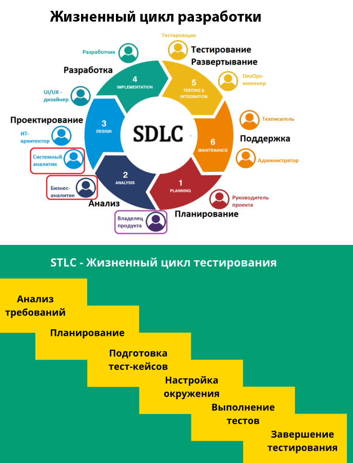
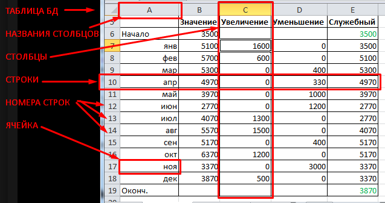
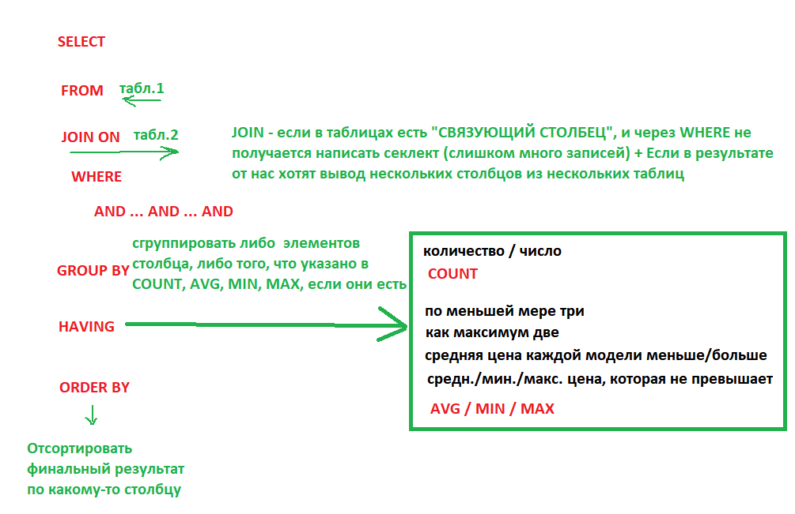

# TestingLectures - Lectures for testing courses
MD Format - https://github.com/tchapi/markdown-cheatsheet/blob/master/README.md

100 вопросов ручному тестировщику - https://atesting.ru/100-samyh-popyliarnyh-voprosov-i-otvetov-na-sobesedovanii-po-testirovaniu-programmnogo-obespecheniia/

| Название                                             |  Ссылка                                                                 |
|----------------------------------------------------- |-------------------------------------------------------------------------|
| **Фундаментальная теория тестирования**              | https://habr.com/ru/post/549054/                                        |
| Чек-лист подготовки к собеседованию                  | https://habr.com/ru/company/renins/blog/564522/                         |
| Собеседование тестировщика — cкользкие вопросы       | https://testengineer.ru/sobesedovanie-testirovshchika-skolzkie-voprosy/ |
| Каких ответов я жду на собеседовании по тестированию | https://habr.com/ru/post/254209/                                        |
| Прочее                                               | http://www.protesting.ru/testing/testdeliverables.html                  |

## НАЙТИ ВСЕ ССЫЛКИ НА САЙТЕ
- Поиск всех кликабельных Ссылок и Кнопок
- https://smallseotools.com/website-link-analyzer-tool/
## Pairwise Online-Составитель таблиц для попарного тестинга
- https://pairwise.teremokgames.com/

|

# СОДЕРЖАНИЕ

- [ _________________________ ПРОЧЕЕ ________________________              ](#p00) <a name="bp00"></a>
- [Задачи на соображалку                                                  ](#p01) <a name="bp01"></a>
- [100 этажей и шары из стекла                                            ](#p02) <a name="bp02"></a>
- [Задача с курицами несущими яйца в день                                 ](#p03) <a name="bp03"></a>
- [Задача с яблоками и грушами                                            ](#p04) <a name="bp04"></a>
- [Разница между ВЕБ и Мобильным приложением                              ](#p05) <a name="bp05"></a>
- [Адаптивный дизайн / Вёрстка                                            ](#p06) <a name="bp06"></a>
- [Кроссбраузерность                                                      ](#p07) <a name="bp07"></a>
- [Кроссплатформенность                                                   ](#p08) <a name="bp08"></a>
- [Виртуальные машины / Виртуалки ________________________________________](#p08) <a name="bp08"></a>
- [HTML / CSS / javaScript                                                ](#p09) <a name="bp09"></a>
- [POSMAN                                                                 ](#p10) <a name="bp10"></a>
- [DevTools                                                               ](#p11) <a name="bp11"></a>
- [Инструменты тестировщика                                               ](#p12) <a name="bp12"></a>
- [Инструменты тестировщика и Аналитика                                   ](#p13) <a name="bp13"></a>
- [Требования                                                             ](#p14) <a name="bp14"></a>
- [Требования и их ЦЕЛЬ / Цели требований / Зачем нужны:                  ](#p15) <a name="bp15"></a>
- [Виды Типы требований / Какие бывают Требования                         ](#p16) <a name="bp16"></a>
- [Виды тестовой документации / Тестовой Документация                     ](#p17) <a name="bp17"></a>
- [Цель тестовой документации                                             ](#p18) <a name="bp18"></a>
- [Процесс тестирования (Этапы тестирования)                              ](#p19) <a name="bp19"></a>
- [Жизненный Цикл Разработки                                              ](#p20) <a name="bp20"></a>
- [Жизненный Цикл Тестирования                                            ](#p21) <a name="bp21"></a>
- [МЕТОДОЛОГИИ РАЗРАБОТКИ                                                 ](#p22) <a name="bp22"></a>
- [WATERFALL, AGILE / SCRUM, KANBAN                                       ](#p23) <a name="bp23"></a>
- [WATERFALL - ВАТЕРФОЛ - ВОДОПАД                                         ](#p24) <a name="bp24"></a>
- [AGILE - ЭДЖАЙЛ - и **SCRUM** - СКРАМ                                   ](#p25) <a name="bp25"></a>
- [KANBAN - КАНБАН                                                        ](#p26) <a name="bp26"></a>
- [ _________________________ ТЕСТИРОВАНИЕ __________________             ](#t00) <a name="bt00"></a>
- [Какую литаретуру по тестированию читали ?                              ](#t01) <a name="bt01"></a>
- [Что такое тестирование ПО ?                                            ](#t02) <a name="bt02"></a>
- [Цель тестирования                                                      ](#t03) <a name="bt03"></a>
- [Верификация и валидация                                                ](#t04) <a name="bt04"></a>
- [Что такое Дефект / Ошибка / Баг                                        ](#t05) <a name="bt05"></a>
- [Серьёзность бага / Типы Серьезности дефекта (Severity)                 ](#t06) <a name="bt06"></a>
- [Приоритет бага / Типы Приоритета дефекта (Priority)                    ](#t07) <a name="bt07"></a>
- [Приведите примеры Критического, Значительного и Незначительного бага   ](#t08) <a name="bt08"></a>
- [Шкала приоретизации ошибки / Шкала Серьезности / Шкала Приоритета Бага ](#t09) <a name="bt09"></a>
- [СКВОЗНОЕ / E2E / End-To-End / EndToEnd / ЭндТуЭнд тестирование         ](#t10) <a name="bt10"></a>
- [Пирамида тестирования                                                  ](#t11) <a name="bt11"></a>
- [УРОВНИ тестирования (Их выделяют либо 3, либо 5)                       ](#t12) <a name="bt12"></a>
- [Виды тестирования / Какие ВИДЫ тестирования ты знаешь (всего 3 ВИДА)   ](#t13) <a name="bt13"></a>
- [Методы и Типы тестирования                                             ](#t14) <a name="bt14"></a>
- [Дымовые / Дымное (Smoke)                                               ](#t15) <a name="bt15"></a>
- [Санитарное / Санити (Sanity) тестирование                              ](#t16) <a name="bt16"></a>
- [Регрессионное                                                          ](#t17) <a name="bt17"></a>
- [РеТест                                                                 ](#t18) <a name="bt18"></a>
- [Интеграционное                                                         ](#t19) <a name="bt19"></a>
- [Что такое Техники тест-дизайна / техники тестдизайн ?                  ](#t20) <a name="bt20"></a>
- [Примеры Техник тест-дизайна ? ПРИМЕРЫ                                  ](#t21) <a name="bt21"></a>
- [Чек-лист / Чеклист / Тест-Кейс / ТестКейс / Баг Репорт / БагРепорт     ](#t22) <a name="bt22"></a>
- [Автоматизация на проекте                                               ](#t23) <a name="bt23"></a>
- [Жизненный цикл ПО                                                      ](#t24) <a name="bt24"></a>
- [ЖЦБ / Жизненный цикл Бага / СОСТОЯНИЯ БАГА                             ](#t25) <a name="bt25"></a>
- [ПредПРОД / ПРЕД ПРОДАКШН                                               ](#t26) <a name="bt26"></a>
- [Тестовый Стенд от Продакшн-стенда                                      ](#t27) <a name="bt27"></a>
- [DEV Стенд от слова DEVELOPER:                                          ](#t28) <a name="bt28"></a>
- [Что такое ТЕСТОВЫЕ МОДЕЛИ ___                                          ](#t29) <a name="bt29"></a>
- [ ____________ Клиент Сервер | Стуктуры данных | XML | JSON ____________ ](#cs600) <a name="bc00"></a>
- [Клиент Серверная архитектура / Клиент Серверное взаимодействие         ](#cs601) <a name="bcs601"></a>
- [Как пользователь (клиент) Запрашивает данные                           ](#cs602) <a name="bcs602"></a>
- [Как происходит обмен между Клинтом и Сервером                          ](#cs603) <a name="bcs603"></a>
- [Как может общаться между собой Клиент и Сервер                         ](#cs604) <a name="bcs604"></a>
- [Какими структурами данных может общаться между собой Клиент и Сервер   ](#cs605) <a name="bcs605"></a>
- [Разница между Бек и Фронт / Бэк и Фронт / Бек и Фронт                  ](#cs606) <a name="bcs606"></a>
- [JSON (умеет хранить древовидные структуры)                             ](#cs607) <a name="bcs607"></a>
- [XML (умеет хранить древовидные структуры)                              ](#cs608) <a name="bcs608"></a>
- [ ________________________ СЕТИ | API | REST | HTTP ______________      ](#n00) <a name="bn00"></a>
- [Что такое API                                                          ](#n01) <a name="bn01"></a>
- [Что такое API ... ЕЩЁ                                                  ](#n02) <a name="bn02"></a>
- [REST / REST-API                                                        ](#n03) <a name="bn03"></a>
- [SOAP / SOAP-API                                                        ](#n04) <a name="bn04"></a>
- [Что такое REST                                                         ](#n05) <a name="bn05"></a>
- [МЕТОДЫ REST - https://htmlacademy.ru/blog/best/get-vs-post             ](#n06) <a name="bn06"></a>
- [МЕТОДЫ HTTP / ЕСТЬ ЛИ ЕЩЁ ДРУГИЕ МЕТОДЫ REST                           ](#n07) <a name="bn07"></a>
- [Если был выполнен запрос с кодом 201 и какой метод был выполнен        ](#n08) <a name="bn08"></a>
- [Какие запросы самые частые ? ответ: POST и GET (Отличия)               ](#n09) <a name="bn09"></a>
- [Чем отличается POST от PUT / PUT от POST                               ](#n10) <a name="bn10"></a>
- [Чем отличается POST от PUT / отличия PUT от POST                       ](#n11) <a name="bn11"></a>
- [Чем отличается POST от GET / GET от POST                               ](#n12) <a name="bn12"></a>
- [Чем отличается POST от GET / отличия GET от POST                       ](#n13) <a name="bn13"></a>
- [ИДЕМПАТЕНТНЫЙ метод                                                    ](#n14) <a name="bn14"></a>
- [Коды HTTP - https://developer.mozilla.org/ru/docs/Web/HTTP/Status      ](#n15) <a name="bn15"></a>
- [POST - можно ли удалить данные ?                                       ](#n16) <a name="bn16"></a>
- [PUT - можно ли удалить данные                                          ](#n17) <a name="bn17"></a>
- [GET - можно ли удалить данные                                          ](#n18) <a name="bn18"></a>
- [Разница между TCP и UDP                                               ](#n19) <a name="bn19"></a>
- [Разница между HTTP и HTTPS                                             ](#n20) <a name="bn20"></a>
- [Что такое КУКИ                                                         ](#n21) <a name="bn21"></a>
- [Что такое КЭШ                                                          ](#n22) <a name="bn22"></a>
- [Что такое Аутентификация и Авторизация и Идентификация                 ](#n23) <a name="bn23"></a>
- [ ________________________ SQL | POSTGRES | БД __________________        ](#d00) <a name="bd00"></a>
- [Что такое База Данных                                                  ](#d01) <a name="bd01"></a>
- [Что уже писали на SQL, запросы какого рода                             ](#d02) <a name="bd02"></a>
- [Нужны ли отношение между таблицами, когда мы делаем JOIN               ](#d03) <a name="bd03"></a>
- [SELECT Шпаргалка                                                       ](#d04) <a name="bd04"></a>
- [CREATE INSERT SELECT UPDATE DELETE (DROP)                              ](#d05) <a name="bd05"></a>
- [- 1 -- СОЗДАНИЕ ТАБЛИЦЫ БД                                             ](#d06) <a name="bd06"></a>
- [- 2 -- ВСТАВКА ЗНАЧЕНИЙ В ТАБЛИЦУ БД                                   ](#d07) <a name="bd07"></a>
- [- 3 -- УДАЛЕНИЕ Записи БД                                              ](#d08) <a name="bd08"></a>
- [- 4 -- ЗАПРОС/ПОЛУЧЕНИЕ ИЗ ТАБЛИЦЫ БД                                  ](#d09) <a name="bd09"></a>
- [- 5 -- ЗАМЕНА/ИЗМЕНЕНИЕ/ОБНОВЛЕНИЕ ДАННЫХ в ТАБЛИЦЕ БД                 ](#d10) <a name="bd10"></a>
- [- 6 -- УДАЛЕНИЕ ТАБЛИЦЫ БД                                             ](#d11) <a name="bd11"></a>
- [ТИПИЧНЫЙ Вопрос с селектом:                                            ](#d12) <a name="bd12"></a>
- [ТИПИЧНЫЙ Вопрос SQL 1:                                                 ](#d13) <a name="bd13"></a>
- [ТИПИЧНЫЙ Вопрос SQL 2:                                                 ](#d14) <a name="bd14"></a>
- [1ая,2ая,3я,4ая,5ая,6-тая НОРМАЛЬНЫЕ ФОРМЫ БД                           ](#d15) <a name="bd15"></a>
- [1-ая НОРМАЛЬНАЯ ФОРМА:                                                 ](#d16) <a name="bd16"></a>
- [2-ая НОРМАЛЬНАЯ ФОРМА                                                  ](#d17) <a name="bd17"></a>
- [3-ТЬЯ НОРМАЛЬНАЯ ФОРМА                                                 ](#d18) <a name="bd18"></a>


# О REST Клиент-Сервере HTTP 
```
Представим себе 2 людей пишущих друг другу письма.
Клиент пишет письмо (Запрос) Серверу. Сервер пишет ответное письмо (Ответ) Клиенту.
Методы POST/PUT/GET/DELETE - МАРКИ на письмах. По цвету Макри Сервер понимает что это за письмо.
Письмо с Маркой POST и сервер уже сразу знает, что в письме будет инфа о том, что ему надо что-то создать.
Письмо с Маркой DELETE и сервер сразу понимает, что что-то надо удалить, а что именно удалить уже он прочитает в письме.
GET - не письмо, а открытка, ИБО ТЕЛА (самого пиьма как-бы нет, это был бы пустой конверт в котором письма НЕТ)
На открытке только Марка GET + Заголовок с URL - написано только то, что Клиент хочет запросить
```

# ПРОЧЕЕ <a name="p00"></a> [ BACK ](#bp00)

## Задачи на соображалку  <a name="p01"></a> [ BACK ](#bp01)
### 100 этажей и шары из стекла <a name="p02"></a> [ BACK ](#bp02)
- Имеем 100 этажное здание и какоето число шаров из стекла.
- Определить минимальное число шаров которое нужно выкинуть с этажей, чтобы выяснить начиная с какого этажа они перестают биться

РЕШЕНИЕ: Решение методом половинок
- 100 50 25 12 6 3 2 1 случай когда шары начинают биться только с 1 этажа

Если они начинают биться с допустим 84 этажа, то схема поиска будет такая:
- 100, 50, и двигаемся не вниз а вверх, 50+25 = 75, 75+12 = 87, снова вниз, 87-6 = 81, снова вверх 81+3=84  поиск закончен

https://www.youtube.com/watch?v=j0iBN-O0z10

### Задача с курицами несущими яйца в день <a name="p03"></a> [ BACK ](#bp03)

- 1,5 курицы за 1,5 дня снесли 1,5 яйца.
- Вопрос может быть разный
- Сколько яиц снесут 2 куриц за 2 дней?
- Сколько яиц снесут 3 куриц за 3 дней?
- Сколько яиц снесут 6 куриц за 6 дней?

Суть решения - идут тлько дни, остальное меняется а число дней нет

Рушение: https://www.youtube.com/watch?v=Y8P1wmEwL3I

### Задача с яблоками и грушами <a name="p04"></a> [ BACK ](#bp04)
Задача о трёх ящиках с фруктами

РЕШЕНИЕ: https://www.youtube.com/watch?v=HWb2K15DjQc
РЕШЕНИЕ: все надписи не совпадают, значит там где МИКС из яблок и груш, там точно НЕ микс, там либо яблоки только либо груши только.

### ? Разница между ВЕБ и Мобильным приложением <a name="p05"></a> [ BACK ](#bp05)
- При обновлении сайта/мобилки: **Сайт** - Выкатили сайт, и любое действие пользователя на сайте переведёт его на новую верисю сайта. **Мобилка** - пока пользователь не нажмёт "Обновить приложение" он будет продолжать работать со старой версией приложения
- Сайт - Требует веб-соединения. Моб - После установки Доступно оффлайн
- Для работы с сайтом нужен браузер. Для работы с приложением нужен телефон
- Проверка сайта нужна на нескольких браузерах. Проверка мобильного устройства на нескольких мобилках разных моделей

### ? Адаптивный дизайн / Вёрстка <a name="p06"></a> [ BACK ](#bp06)
- Дизайн АДАПТИРУЮЩИЙСЯ = подстраивающийся под разные
- устройства (ПК, планшет, телефон), ширину/высоту экрана, прочее
- Изменяется не только в размерах что-то, но и трансформация элементов, скрытие и т.д.

### ? Кроссбраузерность <a name="p07"></a> [ BACK ](#bp07)
Работа в Разных Браузерах
- Интернет Эксплорер, ФайерФокс, Хром, Опера, Сафари

### ? Кроссплатформенность <a name="p08"></a> [ BACK ](#bp08)
Работа на разных Операционных системах
- Винда, Линукс, МАК, Мобилки
- Инструменты - ВИРТУАЛЬНЫЕ МАШИНЫ (программа симулирует работу компьютера с любой операционной системой)
- ВИРТУАЛЬНЫЕ МАШИНЫ - 1. WM Vare (платная) и 2. VirtualBox (бесплатная)

### ? Виртуальные машины / Виртуалки <a name="p08"></a> [ BACK ](#bp08)
**ВИРТУАЛЬНЫЕ МАШИНЫ** - 1. WM Vare (платная) и 2. VirtualBox (бесплатная)
- Виртуалки = Виртуальные машины - программы которые иммитируют работу целого компьютера с установленной на нём операционной системой - для тестирования десктоп приложений и не только

### ? HTML / CSS / javaScript <a name="p09"></a> [ BACK ](#bp09)
- HTML - язык вёрстки скелета сайта (в нём есть <ТЕГИ АТРИБУТЫ="Знач.Атр.">Знач.Тега</ТЕГИ> кнопки, слайдеры, ссылки это всё описано в html-коде)
- CSS - Файлы описания стилей (стили кнопок, контролов, других элементов сайта, в CSS-файлах описаны цвета/отступы/градиенты/размеры шрифтов и т.д.)
- javaScript - Прочие динамические красивости (файлы .js с кодом написанным на языке программирования javaScript)

### POSMAN: <a name="p10"></a> [ BACK ](#bp10)
Нужен для того чтобы **СФОРМИРОВАТЬ / ПОДГОТОВИТЬ / НАПИСАТЬ  ЗАААПРООООС**

В постмане мы пишем для запроса ЕГО
- REST-Метод (POST, PUT, GET, DELETE, CONNECT, и т.д. )
- ССЫЛКА = URL
- ЗАГОЛОВОК = HEADER
- ТЕЛО = BODY

Ссылку, Заголовок и Тело мы напишем Сами, а как их написать, мы прочитаем в Документации к Сайту или в описании API-сайта.


### DevTools: <a name="p11"></a> [ BACK ](#bp11)
- Просмотр HTML-разметки сайта (все теги, атрибуты всех элементов на сайте (кнопки, картинки, ссылки, и прочие элементы интерфейса сайта) )
- Консоль разработчика - Сами запросы и Коды ошибок (можно посмотреть подробности)
- Исходные коды сайта (не все только те что открыты) - некоторые папки, файлы, картинки и прочее что на сайте открыто
- Сеть - Все подробности про то какие HTTP-МЕТОДЫ отправлялись и получались. -  POST, PUT, GET, DELETE, CONNECT, и т.д. с КОДАМИ ответов 200, 400, 404, и т.д. можно смотреть в заголовки и тела запросов и ответов 
- Производительность
- Память (расход)
- Безопасность (шифрование)

### Инструменты тестировщика <a name="p12"></a> [ BACK ](#bp12)
- **DevTools** - Просмотр HTML-разметки, Консоль разработчика - Сами запросы и Коды ошибок, Исходные коды сайта, Сеть - Все подробности про то какие HTTP-МЕТОДЫ
- **Proxyman** - Имитация сетевого профиля (например, EDGE, 3G, 4G), что позволяет нам обнаруживать скрытые ошибки до того, как он будет запущен
- Снифферы - Прослушка сетевого трафика
  - **Вайршарк** - WireShark
  - Чарльз - Charles Proxy - инструмент для мониторинга HTTP/HTTPS трафика. Программа работает как прокси-сервер между мобильным приложением
  - Фидлер - Fiddler
- Тестирование API
  - **Postman** - Только протокол: REST
  - **SoapUI** - Протоколы: REST + soap + графКуЭль
  - И Postman И SoapUI - это HTTP-клиент для тестирования API. HTTP-клиенты тестируют отправку запросов с клиента на сервер и получение ответа от сервера
- Тестирование производительности: **JMeter**;
- Тестирование безопасности: Kali linux, Santoku Linux + drozer, OWASP ZAP, …;
- Тестирование UI/UX: Figma, Zeplin, mindmap / майнд-карты;
- Фермы устройств для тестирования мобильных приложений: BrowserStack, Xamarin, AWS;
- Инструменты тестирования Android приложений
- Системы контроля версий: GIT;
- Взаимодействие с базами данных: язык SQL, системы СУБД;
- Системы CI/CD: Jenkins/TeamCity;
- Прочее: мессенджеры, баг-трекинговые системы и TMS, генераторы тестовых данных и т.п.
- Виртуалки = Виртуальные машины - программы которые иммитируют работу целого компьютера с установленной на нём операционной системой - для тестирования десктоп приложений и не только

### Инструменты тестировщика и Аналитика <a name="p13"></a> [ BACK ](#bp13)
- TestRail внутри JIRA
- Текстовые, XML-редакторы и файловые менеджеры
- Генераторы данных
- Инструменты для работы со снимками экранов и записи видео с содержимым
- Планировщики задач и MIND-карты
- Чек-листы

### Требования <a name="p14"></a> [ BACK ](#bp14)
**Требование** — описание того, какие функции и с соблюдением каких условий должно выполнять приложение в процессе решения полезной для пользователя задачи.

### Требования и их ЦЕЛЬ / Цели требований / Зачем нужны требования <a name="p15"></a> [ BACK ](#bp15)
- Позволяют понять, что и с соблюдением каких условий система должна делать.
- Помогают предотвращать или разрешать конфликтные ситуации.
- Упрощают расстановку приоритетов в наборе задач.
- Позволяют объективно оценить степень прогресса в разработке проекта.

### Виды Типы требований / Какие бывают Требования <a name="p16"></a> [ BACK ](#bp16)
- Требования бывают:
1) ПРЯМЫЕ (формализованные в технической документации, спеки, юзер-стори и прочие формальные артефакты)
2) КОСВЕННЫЕ (основанные на опыте, здравом смысле, пользовательском опыте, стандарте для данного вида продукта или подобных ему)
ВАЖНО: Прямые требования всегда приоритетнее косвенных.»
- Требования бывают ТИПОВ:
1) **ЯВНЫЕ требования** - все, что написал сам тестировщик / получил от аналитиков / заказчика / менеджера. 
2) **НЕЯВНЫЕ требования** - все, что ожидают ваши клиенты, но чего не прописали нигде ни вы ни аналитики
3) **СКРЫТЫЕ требования** - все, что будет приятным сюрпризом для клиента (что мы поймём за клиента, что это необходимо и включим в требования)
- Требования бывают ВИДОВ:
1) Функциональные - описывающие какие функции должен выполнять продукт
2) Нефункциональные - требования к окружению, поддерживаемости, надежности и прочим характеристикам продукта

### Виды тестовой документации / Тестовой Документация <a name="p17"></a> [ BACK ](#bp17)
Тестовая документация бывает двух видов
1) ВНЕШНЯЯ
2) ВНУТРЕННЯЯ

**ВНУТРЕННЯЯ документация** в неё входят:
- Тест-план (документ с описанием тестирования по одному или нескольким направлениям проверок)
- Тестовый сценарий (описанные действия над продуктом в рамках одного бизнес процессв)
- Тестовый комплект (сгруппированные наборы тестов)
- Чек-лист (лист проверок) - документ с двумя стобиками 1. описанием тестов 2. указание прошёл тест или нет
- Тестовый случай (тест-кейс) - 1. описание 2. шаги проведения теста 3. факт. результат + ожид. результат 

**ВНЕШНЯЯ документация** в неё входят:
- Баг-репорт – 1. описание 2. шаги вопсроизведения бага 3. кртичность 4. приоритет 5. статус 6. факт. результат + ожид. результат (может быть так же 7. скриншоты, 8. исходное состояние системы перед тестом 9. версия, сборка, инфа об окружении)
- Запрос на изменение (улучшение) – описание неявных/некритичных косвенных требований, которые не были учтены при планировани
- Отчет о тестировании (тест репорт) – документ, предоставляющий сведения о соответствии/ несоответствии продукта требованиям
- Замечание – короткая записка, комментарий о небольшой неточности в реализации продукта.

### Цель тестовой документации <a name="p18"></a> [ BACK ](#bp18)
Цель – зафиксировать и описать некую проверку в таком виде, чтобы любой тестировщих / программиист / аналитик смог бы прочитать её, когда ему это будет нужно и по описанной документации провести проверку сам, с дальнейшим анализом результата.

### Процесс тестирования (Этапы тестирования) <a name="p19"></a> [ BACK ](#bp19)

- инициация (подготвка окружения, билда, ресурса, БД)
- выявление требований прямых и косвенных (нет требований, нет тестирования)
- генерация тестовых случаев (выписываем все тестовые случаи на основе прямых и косвенных требований)
- отбор показательных тестовых случаев (отбор наиболее значимых тестовых случаев, всех тестов на свете не напишешь, нужно находить баланс качества и количества тестов)
- проведение проверок (сверяемся с документацией или включаем здравый смысл в том, что не описано в ней)
- фиксация результатов (создаём внутреннюю и внешнюю тестовую документацию)
- анализ результатов (соотвествует продукт требованиям или нет)
- передача информации о соответствии проверенного продукта требованиям (передвём внешнеюю тестовую документацию тому кто у нас запросил её изначально, дополнительно указываем на риски, если таковые есть, вдруг что-то не протестированно, не описано в требованиях или есть баги в каких-то кравевых случаях)

### Жизненный Цикл Разработки <a name="p20"></a> [ BACK ](#bp20)

### Жизненный Цикл Тестирования <a name="p21"></a> [ BACK ](#bp21)

В процессе разработки у нас есть следующие этапы:
1. Планирование (составление Требований) - Заказчик (Заказчик) + Менеджер (Исполнитель)
2. Анализ / Дизайн (анализ требований, набросок продукта) - Аналитик + Программист
3. Разработка (написание кода) - Программист
4. Тестирование / Интеграция - Тестировщик
5. Эксплуатация - Тестировщики и спецы Тех. поддержки




# МЕТОДОЛОГИИ РАЗРАБОТКИ  <a name="p22"></a> [ BACK ](#bp22)

### WATERFALL (Водопад), AGILE или SCRUM (Эджайл / Скрам), KANBAN (Канбан) <a name="p23"></a> [ BACK ](#bp23)

Подходы к организации процесса создания Продукта и командной работы (аналитиков, прогеров, тестеров). Мы рассматриваем командная работа = процесс разработки.

(1) **WATERFALL** <a name="p24"></a> [ BACK ](#bp24)
- ВАТЕРФОЛ - ВОДОПАД - подход в следующем  

1. Заказчик + Менеджер + Аналитик долго подготавливают БОЛЬШОЕ ТЗ (Требования (ФТ, НФТ, Документация / Спецификация) )
Они стараются учесть ВСЁ, что только нужно, чтобы разработчик написал полностью всю программу по этому ТЗ.
2. Разработчик получает 300 страниченое ТЗ, делает ПО не отрываясь 3 и более месяцев, заканчивает его и передает в тестирование
3. Тестировщик тестирует всё ПО по Спеке и всё.
4. Выпускаем продукт

- Плюсы: Исполнитель поэтапно выполняет большую глубоко проработанную Спецификацию. Легко идти "По ПЛАНУ" ...
- Минусы: Нет обратной связи с заказчиком. Изза недопониманий на любом этапе разработка может уйти не в ту сторону, и Заказчик в конце получит не то, что заказывал, а будет уже поздно.

(2) **AGILE** <a name="p25"></a> [ BACK ](#bp25)
- ЭДЖАЙЛ - и **SCRUM** - СКРАМ -  методология / "гибкий подход" к разработке. Делать кусочками и постоянно иметь по каждому кусочку обратную связь с заказчиком.

Разбили разработку всего ПО на части

Часть_1,Часть_2,..., Часть_N
```
1 Часть = 1 Спринту
Один Спринт это 2 или 3 или 4 недели
За 1 спринт мы
1.1 планируем / распределяем подзадачи по команде
1.2 пишем ТЗ для части_1 
1.3 разрабатываем фичи для части_1 
1.4 тестируем фичи для части_1 
1.5 Показываем результат Спринта заказчику

и так по частям 

2 Часть = 2 Спринт
2.1 планируем / распределяем подзадачи по команде
2.2 пишем ТЗ для части_2 
2.3 разрабатываем фичи для части_2 
2.4 тестируем фичи для части_2 
2.5 Показываем результат Спринта заказчику

N-Спринтов и получаем
RELEASE!
```

(3) **KANBAN** - КАНБАН <a name="p26"></a> [ BACK ](#bp26)

Есть Спринт - 2-3 недели
Задачи просто набор задач которые определили программисты
**РАЗНИЦА** между Скрамом в том, как распределяются задачи 

В **СКРАМЕ** за каждым разработчиком закреплены конкретные задачи СРАЗУ (с самого начла).

В **КАНБАНЕ** есть Корзина с задачами Общая, и каждый кто какую хочет, тот на протяжении Спринта берёт и выполняет

Задача и в **СКРАМЕ и КАНБАНЕ**, завершить к конце спринта все задачи


**Беклог** - задачи, которые не успели сделать в рамках спритна / Задачи которые появились новые в результате спринта / Задачи у которых понизился приоритет, которые можно будет сделать и потом, или вообще стали не обязательными (бантики / подвязка бантиков)


# ###################################
# ТЕОРИЯ ТЕСТИРОВАНИЯ <a name="t00"></a> [ BACK ](#bt00)
# ###################################


### ? - Какую литаретуру по тестированию читали ? <a name="t01"></a> [ BACK ](#bt01)
- Романа Савина - "тестирование дот ком"
- Святослав Куликов "Тестирование программного обеспечения. Базовый курс"
- SQL-ex на этом сайте исзучала SQL на практике

### ? - Что такое тестирование ПО ? <a name="t02"></a> [ BACK ](#bt02)

**Тестирование** – комплекс мероприятий, направленный на проведение 
проверок на соответствие производимого продукта требованиям, к нему предъявляемым (прямым и косвенным).

### ? - Цель тестирования <a name="t03"></a> [ BACK ](#bt03)
**Цель тестирования** 
- проверили продукт на соотв. требованиям
- выявили (нашли и зафиксировали) ошибки
- контроль за тем, что ошибку устранили

— проверка соответствия ПО предъявляемым требованиям, обеспечение уверенности в качестве ПО, 
поиск ошибок в программном обеспечении, которые должны быть выявлены до того, 
как их обнаружат пользователи программы.

### ? - Верификация и валидация <a name="t04"></a> [ BACK ](#bt04)

- **Верификация** (Verification) — это процесс оценки системы или её компонентов с целью определения удовлетворяют ли результаты текущего этапа разработки условиям, сформированным в начале этого этапа. 
- **Валидация** (Validation) — это определение соответствия разрабатываемого ПО ожиданиям и потребностям пользователя, требованиям к системе.

### ? - Что такое Дефект / Ошибка / Баг <a name="t05"></a> [ BACK ](#bt05)
- факт несоответствия (прямым или косвенным) требованиям, продукта 
- с оценкой его критичности/серъёзности и Приоритета.

### ? - **ТИПЫ КРИТИЧНОСТИ Бага ТИПЫ Серьезности дефекта (Severity)** <a name="t06"></a> [ BACK ](#bt06)

- S1 Блокирующая = БЛОКЕР = Blocker - приложение в полностью нерабочем состоянии
- S2 Критическая (Critical) - система работает, НО не работает часть системы, обишка в ключевой бизнес логике, дыра в системе безопасности, и т.д.
- S3 Значительная (Major) - Ошибка не критична или есть возможность для работы с тестируемой функцией, используя другие входные точки.
- S4 Незначительная (Minor) - не нарушающая бизнес логику тестируемой части приложения, очевидная проблема пользовательского интерфейса.
- S5 Тривиальная (Trivial) - не касающаяся бизнес логики приложения, плохо воспроизводимая проблема, малозаметная

### ? - **ТИПЫ Приоритета дефекта (Priority)** <a name="t07"></a> [ BACK ](#bt07)
- Высокий (High) - исправить как можно быстрее, ее наличие является критической для проекта.
- Средний (Medium) - исправить надо, НО ее наличие не является критичной.
- Низкий (Low) - исправить надо, НО ее наличие не является критичной, и НЕ требует срочного решения.

### ? - Приведите примеры Критического, Значительного и Незначительного бага. <a name="t08"></a> [ BACK ](#bt08)
Пример Интернет-магазин:
- S1 Блокер - упал сервер, сайт не работает
- S2 Упал раздел сайта, сам сайт работает, но целый раздел не доступен
- S3 На сайте всё работает, но неверно работает калькулятор суммы покупки, а сайтом и этой функцией пользуются вообще все покупатели
- S4 Сайт работет, но кнопка В корзину работает так, что пользователь не видит что он отправляет, ему приходится обновлять станицу, и тогда всё ок
- S5 НА последней странице сайта в разделе реквизитов компании в самом конце страницы виден артефакт вёрстки, какой-то лишний символ, но на него всем всёравно

### ? Шкала приоретизации ошибки / ШКАЛА Серьезности / ШКАЛА Приоритета Бага <a name="t09"></a> [ BACK ](#bt09)
https://www.software-testing.by/blog/bug-severity/

- У бага есть 1. **Серьезностиь** = КРИТИЧНОСТЬ дефекта + 2. **Приоритет**
- Количество пользователей которых затронул Баг Увеличивает Оба параметра  и Серъёзность и Приоритет (или понижает, если баг затронул мало)

Определяется **КОЛИЧЕСТВОМ ПОЛЬЗОВАТЕЛЕЙ**, которых **ЗАТРОНЕТ** конкретный БАГ. То есть Чем больший процент пользователей столкнулся с конкретным багом тем ВЫШЕ его Приоритет+Серьёзность сразу.

Пример (СЕРЪЁЗНОСТЬ НИЗКАЯ, И ПРИОРИТЕТ НИЗКИЙ):
1) На сайте где-то в каком-то разеде средней1 посещаемости есть опечатки.
Пример (СЕРЪЁЗНОСТЬ НИЗКАЯ, А ПРИОРИТЕТ ВЫСОКИЙ):
2) На сайте есть опечатка в названии компании, вцелом это всего-лишь опечатка (сръёзность низкая), НО в имени компании (и отсюда возрастает её приоритет).
Пример (СЕРЪЁЗНОСТЬ ВЫСОКАЯ, А ПРИОРИТЕТ НИЗКИЙ):
3) По логину и паролю не могут с первого раза зайти 3 юзера из 10.000 .
Пример (СЕРЪЁЗНОСТЬ ВЫСОКАЯ, И ПРИОРИТЕТ ВЫСОКИЙ):
4) 9.000 пользователей не могут зайти в аккаунт из 10.000

БАГ один и тот же, НО Приоритет + Серьёзность Для этих двух случаев СИЛЬНО РАЗНЫЕ.

(в каком-то смысле помним, что затронутые пользователи = количество денег которые будет терять бизнес)


### ? - Что такое СКВОЗНОЕ / E2E / End-To-End / EndToEnd / ЭндТуЭнд тестирование ? <a name="t10"></a> [ BACK ](#bt10)
- оно же End-to-end или E2E, — это процесс тестирования, при котором происходит подробная эмуляция пользовательской среды. Целью сквозного тестирования является создание полного производственного сценария. 

То есть при данном тестировании имитируют:
- щелчки мышью, 
- нажатия на кнопки, 
- заполнение форм, 
- переходы по страницам и ссылкам,
- и другие поведенческие факторы.

### ? Пирамида тестирования <a name="t11"></a> [ BACK ](#bt11)
Описывает эффективный подход к планированию и проведению тестирования. Она показывает как тесты делать, и сколько тестов и каких должно быть

```
       / \        максимально "дорого"
     / е2е \      ^
   /АПИ-тесты\    | ЦЕНА ПОДДЕРЖКИ | ПОКРЫТИЕ | ХРУПКОСТЬ СИСТЕМЫ |
 / ЮНИТ ТЕСТЫ \   V
/--------------\  максимально "дешёво"

<--количество--> 
    тестов
```

- **е2е** / ЕндТуЕнд тесты - мало - тесты графического интерфейса
- **АПИ-тесты** - Средне - их среднее число **их пишут тестеры**, которые подготавливает тестер, и тестирует их руками / или в автоматическом режиме при помощи Авто-тестов.
- **ЮНИТ ТЕСТЫ** - МНОГО - их больше всего и **их пишут программисты** прямо на этапе разработки (тестировщик на них не влияет, тестер только сообщает, что они упали/прошли). Они должны в самом начале ещё показать программисту, где у него в коде баг.

ПАРАМЕТРЫ у каждой ступени пирамиды такие: **ПОКРЫТИЕ**, **ЦЕНА ПОДДЕРЖКИ**, **ХРУПКОСТЬ СИСТЕМЫ**

**АПИ-тесты** - не графические а именно АПИ - подороже, ибо выявить баг сложнее, тестеру надо понять как баг воспроизвести, кодеру разобраться в написанном и решить проблему

**ЮНИТ-тест** - тест функций программного кода - максимально дешёво (для бизнеса, продуктом ещё никто не пользуется, а баги уже исправляются), кодер быстро правит сам, то что он легко заметит, легко устранит, и он даже не тратить времени на передачу нам в тестирование эти баги

### ? УРОВНИ тестирования (Их выделяют либо 3, либо 5) <a name="t12"></a> [ BACK ](#bt12)
Уровни тестирования ПО:
1. Модульное = Компонентное тестирование (тест отдельных компонентов / модулей от всей системы)
2. Интеграционное тестирование (корректно ли модули работают не отдельно друг от друга, а все вместе друг с другом)
3. Системное тестирование (проверка функциональных, и не функциональных требований, поиск дефектов в системе в целом)
4. Приемочное тестирование (проверка на соответствие требованиям чтобы проверить на сколько ПО готово к приёмке заказчиком)
5. Регрессионное тестирование (После внесения новых фич, не поломали ли эти новые фичи, что-то старое, работающее и уже отлаженное/протестированное)

### ? - Какие ВИДЫ (их всего 3 ВИДА) тестирования ты знаешь ? <a name="t13"></a> [ BACK ](#bt13)
1. **Функциональное**
2. **НЕФункциональное** 
3. **Сопровождения (связанные с изменениями)**


- **(1) Функциональное** (Верно ли работает ПО по функционалу (2+2=4)).
  - Смоук Дымное тестирование (поверхностное - тест на то работает ли впринципе)
  - Санити = Санитарное (проверка общего состояния системы в деталях, перед более тщательным тестированием)
  - Модульное = Компонентное = Блочное = Юнит = тестирование (проверка на корректность работы отдельных модулей исходного кода программы) 
  - Интеграционное тестирование - ПО состоит из нескольких модулей (они тестируются все вместе, как группа), проверяем корректность работы этих модулей друг с другом + обмена данными между ними. 
  - Пользовательское удобство (Юзабилити) - инуитивно понятен ли пользователю интерфейс и работа ПО вцелом
  - Тетисрование пользовательского интерфейса - всё ли работает так как по спецификации описано
  - Тестирование локализации (Как ПО подстраивается при смене языка пользователя)
  - Тестирование глобализации (Как ПО подстраивается к культуре пользователя)
  - Тестирование совместимости (Как ПО работает на другой ОС, другом железе, в другой пользовательской среде) и т. д.

- **(2) НЕФункциональное**  (Как/на сколько удобно юзеру (удобно ли юзеру/рам видеть 2 + 2 = 4 или 2+2=4 и т.д.)).
  - **Тестирование безопасности** - **(?)** (а может это функц тестир. ? СМ НИЖЕ **(НЮАНС 1)**)) 
  - **Нагрузочное тестирование** - плавное повышение нагрузки - **(?)** (а может это функц тестир. ? СМ НИЖЕ **(НЮАНС 2)**))
  - Стрессовое тестирование (когда нагрузка на систему скачкообразное)
  - Производительности / Тестирование на производительноcть (как быстро работает система под строго определённой нагрузкой)
  - Тестирование стабильности / надёжности (длительное время с средней нагрузкой)
  - Объемное тестирование (проверка работы при больших объёмах данных)
  - Тестирование масштабируемости (способность системы запрашивать/включать доп. мощности)
  - Приёмочное тестированиеи (на этапе сдачи готового продукта заказчику)
  - Тестирование на отказ и восстановление (как система восстановится, после отказа оборудования, сбоев в сети, проблемах в связи)
  - Тестирование Утсановки т.д.

- **(3) Сопровождения (связанные с изменениями)**
  - Регрессионное - Проверка на то, не роняет ли разработанная сейчас фича, то, что безошибочно работало ранее. (в уже оттестированное ПО добавили фичу, надо проверить не поломала ли новая фича работоспособность старых фич, уже отлаженных и корректно работающих)
  - Тестирование на эксплуатации
  - 
--------------------------------------------
**(НЮАНС 1)**
- Строго говоря - **Тестирование безопасности** - это НЕФункциональное тестирование, НО
- АНТИВИРУС - ЕСЛИ основной функцией ПО/Веб-сервиса - обеспечивать Безопасность, ТО тестирование на безопасность можно для него считать Функциональным

**(НЮАНС 2)**
- Строго говоря - **Нагрузочное тестирование** - это НЕФункциональное тестирование, НО
- БАЛАНСИРОВЩИК - ЕСЛИ основной функцией ПО/Веб-сервиса - держать нагрузку, ТО нагрузочное тестирование можно для него считать Функциональным
-------------------------------------------
	
**Прочее: Методы и Типы тестирования**
- АВТО матическое тестирование / Ручное тестирование
- Тестирование методом Чёрного / Серого / Белого Ящика (-)(+)
- Тестирование Негативное / Позитивное
- Статическое - проверяем не приложение, а документацию к нему, графические прототипы, схемы и прочее
- Динамическое - проверяем запущенное работающее приложение


### ? - Дымовые / Дымовое (Smoke) <a name="t15"></a> [ BACK ](#bt15)
Цель — проверить «стабильность» системы в целом,

### ? - Санити / Санитарное (Sanity) тестирование <a name="t16"></a> [ BACK ](#bt16)
- Целью является проверить общее состояние системы в деталях, перед более тщательным тестированием

### ? - Регрессионное <a name="t17"></a> [ BACK ](#bt17)
- Цель - убедиться, что не случился регресс рабочего функционала - убедиться что новые изменения в коде не поломали ранее работающую функциональность

### ? - Ре-тест <a name="t18"></a> [ BACK ](#bt18)
- Цель - выяснить, что ранее заявленные тест кейсы все проходят - проверяет что дефект исправлен (Прошли по всем тесткейсам с первого по последний)

### ? - Интеграционное <a name="t19"></a> [ BACK ](#bt19) 
- как существующие модули работают друг с другом - (4 блока сайта, работает ли корректно обмен данными по протоколу между ними, не вызывют они ошибок в работе друг друга)

# ? - Что такое Техники тест-дизайна ? <a name="t20"></a> [ BACK ](#bt20)
1. Эквивалентное разделение (Equivalence Partitioning)
2. Граничные значения (Boundary Values)
3. Таблица принятия решений (Desicion Table) = Матрица принятия решений
4. Парное тестирование (Pairwise Testing)
5. Причина и следствие
6. Диаграмма перехода состояний (State-transition Diagram)
7. Диаграмма пользовательских ролей (Use Case Diagram)
8. Предугадывание / Угадывание ошибок (Error Guessing)
9. Исследовательское тестирование (Exploratory Testing) 

### ? - Что такое Техники тест-дизайна ? ПРИМЕРЫ: <a name="t21"></a> [ BACK ](#bt21)
На сайте для покупки билетов рассмотрим возрастные группы для которых есть разные цены билетов и разные льготы для разных возрастов:

Возрастные группы : Дети (0-15 лет), Молодые (15-25 лет), Взрослые (25-60 лет) Старики (60-99 лет) В поле ввода возраста можно ввести от 0 до 99, только 2 ЦИФРЫ

- **Эквивалентное разделение** (один и тот же результат теста для одной эквивалентной группы параметров - что 0, что 1, что 2, что 15 - будет ребёнок) Пример: Возрастные группы и покупка билетов:
  - Дети (0-15 среднее = 10), 
  - Молодые (15-25 ср.=18), 
  - Взрослые (25-60 ср.=35), 
  - Старики (60-99 ср.=75)

- **Граничные значения** (большинство ошибок будет на границах - нужно тестить 3 значения - 1. саму границу 2. на единицу больше границы 3. на единицу меньше границы)
  - Дети (0-15 граничные = 0/1 + 14/15/16), 
  - Молодые (15-25 гр. = 14/15/16 + 24/25/26), 
  - Взрослые (25-60 гр. = 24/25/26 + 59/60/61), 
  - Старики (60-99 гр. = 59/60/61 + 98/99/100 - хоть 100 и нельзя внести, но можно попробовать)

- **Таблица принятия решений** (Desicion Table) = Матрица принятия решений. Пример таблицы для 2-ух факторной авторизации (возможные сценарии):
  1. Правильный логин и правильный пароль.
  2. Правильный логин, неправильный пароль.
  3. Неправильный логин, правильный пароль.
  4. Неправильный логин, неправильный пароль.

- **Парное тестирование** (Pairwise Testing) https://habr.com/ru/company/otus/blog/592575/

Суть: **Большинство дефектов как правило вызвано взаимодействием не более двух факторов** (дефекты, которые возникают при взаимодействии трех и более факторов, как правило менее критичны). Следовательно, выбирается пара двух тестовых параметров, и все возможные пары этих двух параметров отправляются в качестве входных параметров для тестирования. Pairwise testing сокращает общее количество тест-кейсов, тем самым уменьшая время и расходы, затраченные на тестирование.

ПРИМЕР: Магазин автомобилей с двумя полями: 
- *Марка автомобиля* [а. BMW б. Audi в. Nissan]
- *Регистрационные номера* [а. Валидные (5000) б. Невалидные]

Судя по описанию потенциальных входных данных для теста будет 3 Х 5000 = 1500 это мы ещё не учли невалидные, которых не понятно сколько нужно взять для теста.

Парное тестирование выделит всего 2 типа номеров: валидный и невалидный Регистрационный номер, и проверять мы будем только по одному валидному и одному невалидному. для каждой Марки автомобиля. В итоге получим такую таблицу Пар:

Модель|	Рег.Номер  |
----- |  --------- | 
BMW   |	Валидный   | 
BMW   |	Невалидный | 
Audi  |	Валидный   | 
Audi  |	Невалидный | 
Nissan|	Валидный   |
Nissan|	Невалидный | 

Итого вместо  3 Х 5000 = 1500 потенциальных тестов

Мы получили всего  3 Х 2 = 6 тестов 

- **Причина и следствие**
Примеры:
1. Тыкнули в чекбокс - посмотрели, что у него проставилась галочка
2. Нажать крестик в правом верхнем углу окна (причина), оно закроется (следвтие)

- **Диаграмма перехода состояни**

Тестируем выключатель света в комнате

| свет горит |  выключить свет ->  | темнота |

| свет горит | <- включить свет    | темнота |

**Исследовательское и Интуитивное тестирование**
- Логика + Здравый смысл
- Собственный пользовательский опыт
- Применить опыт и знания о работе Аналогичного продукта


# ? Чек-лист / Тест-Кейс / Баг Репорт <a name="t22"></a> [ BACK ](#bt22)
### ? - Разница между Тест-кейсом и Чек-листом и Баг-Репортом ?
- Чек-лист - (2) - Таблица из обычно двух стобцов с Только  1. заголовками тестов 2. столбец для Галок / Крестов, чтобы отмечать Пройдент Тест или Нет
- Тест-кейс - (3) - содержит в себе 1. заголовок / описание теста 2. Шаги воспроизведения кейса 3.  **ТОЛЬКО Ожидаемый** результат 4. Скрины 5. Видеозапись
- Баг Репорт - (6) - 1. Короткое описание 2. Серьезность 3. Приоритет (очередь исправления ошибки). 4. Статус (из жизненного цикла). 5. Шаги воспроизведения 6. **И Ожидаемый** результат + **И Фактический** результат

### ? - Автоматизация на проекте ? <a name="t23"></a> [ BACK ](#bt23)
- По поводу автоматизации на питоне / джаваскрипте ?
- Программировать пробовала или нет ещё ?

### ? - Жизненный цикл ПО: <a name="t24"></a> [ BACK ](#bt24)

1. анализ требований к проекту
2. проектирование
3. реализация
4. тестирование продукта
5. внедрение и поддержка

### ? - ЖЦБ - Жизненный цикл Бага: <a name="t25"></a> [ BACK ](#bt25)

http://www.protesting.ru/testing/bug_lifecycle.html

СОСТОЯНИЯ БАГА:
0. Обнаружен
1. 1.1 Открыт 1.2 Отклонён 1.3 Отсрочен
2. Переоткрыт 
3. Исправлен
4. Закрыт

Варианты Жизненного цикла Бага:
- Классика 1: 0. Обнаружен -> 1.2 Открыт -> 3. Исправлен -> 4. Закрыт
- Классика 2: 0. Обнаружен -> 1.2 Открыт -> 3. Исправлен -> 2. Переоткрыт -> 3. Исправлен -> 2.-> 3.-> ... -> цикл пока не -> 3. Исправлен Окончательно -> 4. Закрыт
- Не редко: 0. Обнаружен -> 1.2 Отклонён -> 4. Закрыт
- Не редко: 0. Обнаружен -> 1.3 Отсрочен -> 4. Закрыт
- Тоже бывает: 0. Обнаружен -> 1.2 Отклонён -> 4. Переоткрыт -> Начинаем цикл с Открыт


### ? - ПредПРОД = ПРЕД ПРОДАКШН: <a name="t26"></a> [ BACK ](#bt26)
- ПРЕД ПРОД **СТЕНД** - в идеале, это **СРЕДА** идентичная или максимально приближенная к продуктивной: те же данные, то же аппаратно-программное окружение, та же производительность. Она используется, чтобы сделать финальную проверку ПО в условиях максимально приближенным к «боевым».

### ? - Тестовый Стенд от Продакшн-стенда: <a name="t27"></a> [ BACK ](#bt27)
- Тестовый СРЕДА для проверок, которые иммитируют боевой стенд

### ? - DEV Стенд от слова DEVELOPER: <a name="t28"></a> [ BACK ](#bt28)
- стенд разработки на нем непрерывно появляются новые версии от разрабов

### Что такое тестовые модели <a name="t29"></a> [ BACK ](#bt29)

**Тестовые модели** — это схема, наглядное описание тестируемой системы. Тестовыми моделями могут служить схемы, таблицы, диаграммы переходов состояний и в некоторых случаях даже майнд-карты (mind-map). В идеале тестовые модели должны создаваться на этапе проектирования системы (или ее отдельного компонента) и понятно демонстрировать влияние одной части ПО на другую.


# ###################################
# Клиент Сервер | Стуктуры данных | XML | JSON <a name="сs600"></a> [ BACK ](#bсs600)
# ###################################

## https://blog.skillfactory.ru/glossary/rest-api/

### ? - Клиент Серверная архитектура / Клиент Серверное взаимодействие: <a name="сs601"></a> [ BACK ](#bсs601)
ОТВЕТ: 
- **Клиент** это как правило сторона на которой работает Пользователь (например с Сайтом через Браузер). **Сервер** это как правило сторона где находится сам сайт, который как правило работает на своей стороне с **БАЗОЙ ДАННЫХ** сайта
- Общение между Клиентом и Сервером как правило работает через систему **ЗАПРОСОВ** и **ОТВЕТОВ** (Клиент отправляет запросы, сервер их примнимает (ПАРСИТ = смотрит содержимое - выясняет что клиенту нужно) и сервер подготавливает и отправляет клинту ответы, клиент получает ответы (ПАРСИТ = смотрит содержимое - и понимает что ему ответил сервер).
- Бывают разные варианты клиент-серверных взаимодейтсвий:

(клиент) один-один (севрер)

_________ один-много

_________ много-один

(клиентов) много-много (серверов)

### ? - Как пользователь (клиент) Запрашивает данные? <a name="сs602"></a> [ BACK ](#bсs602)
- При помощи HTTP запросов

### ? - Как происходит обмен между Клинтом и Сервером ? 
### ? -Как может общаться между собой Клиент и Сервер ?
### ? - Какими структурами данных может общаться между собой Клиент и Сервер ?
- JSON -ами
- XML -ями
- Теоретически ещё и обычным текстом безо всяких форматов (если так захотел разработчик)
- Через Запрос - Ответ (А в запросах и ответах уже всё, что назвали выше JSON, XML, обычный текст)

### ? - Разница между Бек и Фронт / Бэк и Фронт / Бек и Фронт: <a name="cs606"></a> [ BACK ](#bcs606)
- Фронт - графическое представление сайта, то с чем работает обычно пользователь руками+мышкой+клавой
- Бэк - всё, что находится на серверной стороне сайта. Исходный код сайта + База данных сайта.

### ? - JSON (умеет хранить древовидные структуры) <a name="cs607"></a> [ BACK ](#bcs607)
- хранит всё парами **КЛЮЧ** : **ЗНАЧЕНИЕ**
```
{
  "ключ_1": "значение-строка",
  "ключ_2": 1234, // значение число
  "ключ_5": [ 1, 2, 3], // значение массив // значения в массиве через запятую
}
```

### ? - XML (умеет хранить древовидные структуры) <a name="cs608"></a> [ BACK ](#bcs608)
- хранит всё как **<ТЕГ>ЗНАЧЕНИЕ</ТЕГ>** 
- <**тег**-открывающий>*значение_тега*</**тег**-закрывающий>
- <тег>значение_тега</тег>
- <тег **атрибут_1** = значение_атрибута_1, **атрибут_2** = значение_атрибута_2 > значение_тега </тег>
- Теги стоят в треугольных скобках, а значение тега стоит между тегами
- Атрибуты (свойства) - стоят всегда в открывающем теге сразу после имени открывающего тега


# ###################################
# СЕТИ | API | REST | HTTP <a name="n00"></a> [ BACK ](#bn00)
# ###################################

### ? - Что такое API: <a name="n01"></a> [ BACK ](#bn01)
ОТВЕТ:
- это в первую очередь **ФУНКЦИИ**, которые делаются для Внутреннего или Внешнего использования
- ВНУТРЕННЕЕ АПИ - не доступно в Глобальном интернете (не смотрит наружу) - Внутреннее, это когда например внутри предприятия мы тестируем апи сайта нашего банка или страховой компании (мы не хотим чтобы ктото кроме нас получил доступ к счетам, банковским реквизитам и т.д. и нам программисты системы дают какое-то АПИ, для использования только внутри сети предприятия.)
- ВНЕШНЕЕ АПИ - Досупно всем в Глобальной сети интернет (смотрит наружу) - Когда мы хоти написать свой сайт и чтобы на нашем сайте был блок который показывает погоду, мы можем воспользоваться ВНЕШНИМ АПИ Яндекс Погоды или ГУГЛ-погоды и т.д. (эти сайты свободно дают инфу о погоде через своё внешнее апи)


### ? - Что такое API ... ЕЩЁ: <a name="n02"></a> [ BACK ](#bn02)
ОТВЕТ:
- API ... ЕЩЁ - Это своеобразный КОНТРАКТ, в котором описан набор "Рекомендаций" по тому как должны общаться между собой приложения и сервисы.
- Например Есть REST-API и SOAP-API.

# REST и SOAP / REST-API и SOAP-API

## REST <a name="n03"></a> [ BACK ](#bn03)
- Не стандарт - архитектурный стиль (набор рекомендаций как должна работать передача данных)
- пример **REST** это HTTP-протокол
- МЕНЕЕ безопасный и защищённый, чем SOAP (слишком много вольностей +GET например нельзя передавать пароли)
- только клиент-серверная архитектура и только на HTTP
- cостояние клиента не сохраняется на сервере
- обмен данными - **Разные типы данных JSON, XML, просто текст, Картинки, любой формат данных**

## SOAP  <a name="n04"></a> [ BACK ](#bn04)
- Стандарт (набор жёстких и строгих описаний как должна работать передача данных)
- пример **SOAP** это WSDL-протокол
- БОЛЕЕ безопасный и защищённый (безопасность в строгости и том что удобно можно передавать секретные данные, пароли и т.д. и быть уверенным в их сохранности)
- не только клиент-серверная архитектура, и не только HTTP, он поддерживает работу с многими другими протоколами по мимо HTTP
- очень строгий по своему формату и сильно запротоколизированный
- обмен данными - **только XML** только кокнретного формата


### ? - Что такое REST: <a name="n05"></a> [ BACK ](#bn05)
ОТВЕТ: 
- Это такой КОНТРАКТ, который представляет собой набор 
"Рекомендаций" по тому как должны работать между собой приложения и сервисы
- Общение происходит между Клиентом и Сервером
- Общение должно происходить путём Запросов и Ответов
- Для общения должны использоваться REST-методы

### ? - МЕТОДЫ REST: https://htmlacademy.ru/blog/best/get-vs-post <a name="n06"></a> [ BACK ](#bn06)

В REST API есть 4 метода HTTP, которые используют для действий с объектами на серверах:

- **DELETE** - **удалить** объект (на сервре)
- **POST** - **создать** объект (на сервере)
- **PUT** - **обновить** объект (объект уже есть, а мы перезаписываем его на сервере)
- **GET** - **запросить/получить** объект (запросить и получить в ответе информацию об объекте)

### ----------------

- DELETE <=> ответ 200 OK / 202 Принято (в процессе удаления) / 204 Нет Контента (нечего удалять)
- POST   <=> ответ 201 Создано (обязательно, ибо объекта не было изначально)
- PUT    <=> ответ 201 Создано (PUT создаёт, если не находит) / 200 ОК (если нашёл и обновил) /  204 Нет контента (если ресурс обновлялся)
- GET    <=> ответ 200 OK (Данные найдены и отправлены в ответе)

```
Например, чтобы обновить видео про Python по адресу 
http://school.ru/python/2.avi
REST API будет использовать метод PUT, 
а для его удаления — DELETE.
```

# https://qsusha.wordpress.com/2017/10/29/%D1%8D%D1%82%D0%BE-%D1%81%D0%BC%D0%B5%D1%88%D0%BD%D0%BE%D0%B5-%D1%81%D0%BB%D0%BE%D0%B2%D0%BE-%D0%B8%D0%B4%D0%B5%D0%BC%D0%BF%D0%BE%D1%82%D0%B5%D0%BD%D1%82%D0%BD%D1%8B%D0%B9/

### ? - МЕТОДЫ HTTP протокола / ЕСТЬ ЛИ ЕЩЁ ДРУГИЕ МЕТОДЫ REST: <a name="n07"></a> [ BACK ](#bn07)
- В REST обычно указываются основные 4: **DELETE, POST, PUT, GET**
- НО В **HTTP ВСЕГО 9 МЕТОДОВ** - 4 из пункта выше И **ещё 5** методов: **HEAD, OPTIONS, PATCH, TRACE, CONNECT**

- **GET** - НЕТ ТЕЛА - нужен для запроса/получения ответа от сервера (изменений не вносит)
- **HEAD** - то же, что и GET, но без Тела запроса только Заголовок (изменений не вносит)

- **PUT** - обновляет уже cуществующий объект ЦЕЛИКОМ и может создавать новый, если его нет
- **PATCH** - обновляет уже cуществующий объект ЧАСТИЧНО (объект и его данные)

- **CONNECT** - преобразует существующее соединение в тоннель.
- **OPTIONS** - получить параметры текущего HTTP соединения.

- **TRACE** - применяется для диагностики, он позволяет видеть клиенту, что происходит в 
каждом звене цепочки между компьютером клиента и конечным получателем.


### ? - Если был выполнен запрос с кодом 201 и какой метод был выполнен ? <a name="n08"></a> [ BACK ](#bn08)

**201 = СОЗДАН** - Объект был успешно создан. И этот код был получен после того как выполнили скорее всего метод **POST**


### ? - Какие запросы самые частые / самые часто встречающиеся ? ответ: POST и GET <a name="n09"></a> [ BACK ](#bn09)

ответ: Самые частые - POST и GET [Отличия](#n12)

## ? - Чем отличается POST от PUT / PUT от POST: <a name="n10"></a> [ BACK ](#bn10)

### ОТВЕТ: **POST** - **создаёт объект** (на сервере), которого **НЕ БЫЛО РАНЬШЕ** <=> **PUT** - **обновляет УЖЕ СУЩЕСТВУЮЩИЙ объект** ИЛИ создаст новый, если не нашёл, то что надо было обновить.

- **POST** - **создать объект** (на сервере), которого на сервере ЕЩЁ НЕТ **В КАЖДЫЙ СВОЙ ВЫЗОВ**. Если выполним 10 раз один и тот тоже POST, то создастся 10 идентичных записей - ответ 201 Создан
- **PUT** - **обновить УЖЕ СУЩЕСТВУЮЩИЙ объект ЦЕЛИКОМ**, мы перезаписываем его на сервере **(!!!) ИЛИ PUT Создаёт новый**, если такого объекта ещё нет ответ 200 OK (нашёл+обновил) / ответ 201 Создан (не нашёл => создал)

РАЗНИЦА: <a name="n11"></a> [ BACK ](#bn11)

1. POST создаёт объект, которого на сервере ЕЩЁ НЕТ 

<=> PUT - обновляет объкт, который на сверере УЖЕ СУЩЕСТВУЕТ (если его не существует, PUT его Создаст)

2. POST в случае успеха всегда должен возвращать статус 201 (Created) и Location на новый ресурс.

<=> PUT же может возвращать как 201 (если ресурс не найден), так и 204 (No Content) — если ресурс обновлялся.

3. POST - НЕИдемпатентный - каждый раз создавая НОВЫЙ объект мы в ответе получаем РАЗНЫЙ ответ с новой инфой о новом объекте -  в свою очередь, может создавать новые объекты при последовательных запросах на один урл.

<=> PUT - ИДЕМПАТЕНТНЫЙ - каждый раз получаем в ответе ОДНУ и ТУЖЕ информацию об объекте который обновили - т.е. несколько одинаковых последовательных пут-запросов на один урл (и с одинаковыми параметрами) НЕ создают новых объектов.


## ? - Чем отличается POST от GET / Чем отличается GET от POST: <a name="n12"></a> [ BACK ](#bn12)

### ОТВЕТ: У **POST ЕСТЬ ТЕЛО** (BODY) <=> у **GET - НЕТУ ТЕЛА** (BODY) только URL и заголовок

- **POST** - **создать объект** (на сервере), которого на сервере ЕЩЁ НЕТ **В КАЖДЫЙ СВОЙ ВЫЗОВ**. Если выполним 10 раз один и тот тоже POST, то создастся 10 идентичных записей - ответ 201 Создан
- **GET** - **запросить** и получить в ответе **информацию об объекте** - ответ 200 OK

РАЗНИЦА **ПОДРОБНО**: <a name="n13"></a> [ BACK ](#bn13)

**1. (!!!) ЭТО ОСНОВНОЕ (!!!) POST - есть ТЕЛО (BODY) <=> GET - НЕТУ ТЕЛА (BODY)**

**2. POST Более Безопасный** (пароли/банковские карты/файлы), Параметры размещаются в ТЕЛЕ (BODY)

<=> GET - Небезопасный - ибо КЭШИРУЕТСЯ (остаётся в памяти) - (пароли в нём лучше не передавать) Параметры передаются в URL-е (используются чаще всего для фильтрации)

3. POST - Ограничен только теми размерами которые задаст программист (а так ограничений в длинне URL НЕТ)

<=> GET - ОРГАНИЧЕН по длинне URL-а (2048 символов)

4. POST - НЕИдемпатентный - каждый раз создавая НОВЫЙ объект мы в ответе получаем РАЗНЫЙ ответ с новой инфой о новом объекте

<=> GET - ИДЕМПАТЕНТНЫЙ - каждый раз получаем в ответе ОДНУ и ТУЖЕ информацию об объекте который запросили

### **ИДЕМПАТЕНТНОСТЬ** <a name="n14"></a> [ BACK ](#bn14)
Когда мы делая одно и то же действие (тот же метод,действие,теже параметры,и т.д.) получаем один и тот же результат

Если результат разный, при одном и том же выполнении метода, то он НЕИДЕМПАТЕНТНЫЙ

### ? - ИДЕМПАТЕНТНЫЙ метод

- POST - НЕИдемпатентный - каждый раз создавая НОВЫЙ объект мы в ответе получаем РАЗНЫЙ ответ с новой инфой о новом объекте
- PUT - ИДЕМПАТЕНТНЫЙ - каждый раз получаем в ответе ОДНУ и ТУЖЕ информацию об объекте который обновили
- GET - ИДЕМПАТЕНТНЫЙ - каждый раз получаем в ответе ОДНУ и ТУЖЕ информацию об объекте который запросили
- DELETE - ИДЕМПАТЕНТНЫЙ - 1 раз - удаляем, получаем ОК | 2,3,..,N раз - удаляем ничего не происходит, формально это тоже ОК

ИДЕМПАТЕНТНЫЕ - GET, HEAD, PUT и DELETE. Так же эффектом идемпотентности обладают HTTP методы OPTIONS и TRACE.

### DELEETE - Идемпатентный

Вы можете сколько угодно раз использовать DELETE, но результат будет всегда таким же, как после первого выполнения операции. Например, DELETE /users/4/contacts/3 удаляет контакт с ID 3. Если вы выполните эту же операцию ещё раз, ничего не произойдёт, так как контакт уже


### ? - Коды HTTP - https://developer.mozilla.org/ru/docs/Web/HTTP/Status <a name="n15"></a> [ BACK ](#bn15)

```
100 - Продолжить
101 - Переключение протокола
102 - В обработке
200 - Успешно
201 - СОЗДАН - Объект создан после того как выполнили метод POST (но может и от PUT)
202 - ПРИНЯТО - Запрос принят, но ещё не обработан.
300 - Множественный ответ
302 - Найдено - Объект был временно изменён
304 - Не модифицировано - для кэширования
400 - Плохой запрос - НЕУСПЕХ скорее всего опечатались в адресе
401 - Ошибка авторизации - Ошибка авторизации пользователя
403 - Запрещено - Клиенту запрещено нет прав для доступа к объекту
404 - Не найдено - То что нужно Клиенту не нашлось - объект не найден
500 - Внутренняя ошибка Сервера
501 - Метод не поддерживается на Сервере 
502 - Когда сервер используется как шлюз не получил ответ от основного сервера
503 - Сервис недоступен
```

```
- 100 - Продолжить
- 101 - Переключение протокола
- 102 - В обработке

- 200 - OK - "Успешно". Запрос успешно обработан.
- 201 - Created - "Создано". Запрос успешно выполнен и в результате был создан ресурс. Этот код обычно присылается в ответ на запрос PUT "ПОМЕСТИТЬ".
- 202 - Accepted - "Принято". Запрос принят, но ещё не обработан. Не поддерживаемо, т.е., нет способа с помощью HTTP отправить асинхронный ответ позже, который будет показывать итог обработки запроса. Это предназначено для случаев, когда запрос обрабатывается другим процессом или сервером, либо для пакетной обработки.
- 203 - Non-Authoritative Information - "Информация не авторитетна". Этот код ответа означает, что информация, которая возвращена, была предоставлена не от исходного сервера, а из какого-нибудь другого источника. Во всех остальных ситуациях более предпочтителен код ответа 200 OK.
- 204 - No Content - "Нет содержимого". Нет содержимого для ответа на запрос, но заголовки ответа, которые могут быть полезны, присылаются. Клиент может использовать их для обновления кешированных заголовков полученных ранее для этого ресурса.
- 205 - Reset Content - "Сбросить содержимое". Этот код присылается, когда запрос обработан, чтобы сообщить клиенту, что необходимо сбросить отображение документа, который прислал этот запрос.
- 206 - Partial Content - "Частичное содержимое". Этот код ответа используется, когда клиент присылает заголовок диапазона, чтобы выполнить загрузку отдельно, в несколько потоков.

- 300 - Multiple Choice - "Множественный выбор". Этот код ответа присылается, когда запрос имеет более чем один из возможных ответов. И User-agent или пользователь должен выбрать один из ответов. Не существует стандартизированного способа выбора одного из полученных ответов.
- 301 - Moved Permanently - "Перемещён на постоянной основе". Этот код ответа значит, что URI запрашиваемого ресурса был изменен. Возможно, новый URI будет предоставлен в ответе.
- 302 - Found - "Найдено". Этот код ответа значит, что запрошенный ресурс временно изменен. Новые изменения в URI могут быть доступны в будущем. Таким образом, этот URI, должен быть использован клиентом в будущих запросах.
- 303 - See Other- "Просмотр других ресурсов". Этот код ответа присылается, чтобы направлять клиента для получения запрашиваемого ресурса в другой URI с запросом GET.
- 304 - Not Modified - "Не модифицировано". Используется для кэширования. Это код ответа значит, что запрошенный ресурс не был изменен. Таким образом, клиент может продолжать использовать кэшированную версию ответа.
- 305 - Use Proxy - "Использовать прокси". Это означает, что запрошенный ресурс должен быть доступен через прокси. Этот код ответа в основном не поддерживается из соображений безопасности.
- 306 - Permanent Redirect - "Перенаправление на постоянной основе". Это означает, что ресурс теперь постоянно находится в другом URI, указанном в заголовке Location: HTTP Response. Данный код ответа имеет ту же семантику, что и код ответа 301 Moved Permanently, за исключением того, что агент пользователя не должен изменять используемый метод HTTP: если POST использовался в первом запросе, POST должен использоваться и во втором запросе.

- 400 - Bad Request - "Плохой запрос". Этот ответ означает, что сервер не понимает запрос из-за неверного синтаксиса.
- 401 - Unauthorized - "Неавторизовано". Для получения запрашиваемого ответа нужна аутентификация. Статус похож на статус 403, но,в этом случае, аутентификация возможна.
- 402 - Payment Required - "Необходима оплата". Этот код ответа зарезервирован для будущего использования. Первоначальная цель для создания этого когда была в использовании его для цифровых платежных систем(на данный момент не используется).
- 403 - Forbidden - "Запрещено". У клиента нет прав доступа к содержимому, поэтому сервер отказывается дать надлежащий ответ.
- 404 - Not Found - "Не найден". Сервер не может найти запрашиваемый ресурс. Код этого ответа, наверно, самый известный из-за частоты его появления в вебе.

- 500 - Internal Server Error - "Внутренняя ошибка сервера". Сервер столкнулся с ситуацией, которую он не знает как обработать.
- 501 - Not Implemented - "Не выполнено". Метод запроса не поддерживается сервером и не может быть обработан. Единственные методы, которые сервера должны поддерживать (и, соответственно, не должны возвращать этот код) - GET и HEAD.
- 502 - Bad Gateway - "Плохой шлюз". Эта ошибка означает что сервер, во время работы в качестве шлюза для получения ответа, нужного для обработки запроса, получил недействительный (недопустимый) ответ.
- 503 - Service Unavailable - "Сервис недоступен". Сервер не готов обрабатывать запрос. Зачастую причинами являются отключение сервера или то, что он перегружен. Обратите внимание, что вместе с этим ответом удобная для пользователей(user-friendly) страница должна отправлять объяснение проблемы. Этот ответ должен использоваться для временных условий и Retry-After: HTTP-заголовок должен, если возможно, содержать предполагаемое время до восстановления сервиса. Веб-мастер также должен позаботиться о заголовках, связанных с кэшем, которые отправляются вместе с этим ответом, так как эти ответы, связанные с временными условиями, обычно не должны кэшироваться.
- 504 - Gateway Timeout - Этот ответ об ошибке предоставляется, когда сервер действует как шлюз и не может получить ответ вовремя.
- 505 - HTTP Version Not Supported - "HTTP-версия не поддерживается". HTTP-версия, используемая в запроcе, не поддерживается сервером.
```


### ? - POST - можно ли удалить данные ? <a name="n16"></a> [ BACK ](#bn16)
- ДА, передаём в URL или в ТЕЛО id того, что хотим удалить.
### ? - PUT - можно ли удалить данные ? <a name="n17"></a> [ BACK ](#bn17)
- ДА, - отправляем PUT с пустой строкой и эта пустая строка запишется на месте нашего объекта, который обновили через PUT.
### ? - GET - можно ли удалить данные ? <a name="n18"></a> [ BACK ](#bn18)
- ДА, передаём в URL id того, что хотим удалить, например /delete/1 или /delete.php?id=1 (1 - это значение id).


### ? - Разница между TCP и UDP: <a name="n19"></a> [ BACK ](#bn19)
- TCP - гарантирует доставку и получение (медленнее чем UDP, зато надёжнее)
- UDP просто отправляет в одну сторону и не ждёт подтвержедение о доставке (ненадёжен, зато быстрее чем HTTP)
 
### ? - Разница между HTTP и HTTPS: <a name="n20"></a> [ BACK ](#bn20)
- HTTPS использует шифрование данных
- HTTPS Более безопасный чем старый HTTP, ибо HTTPS работает через **SSL СЕРТИФИКАТ** (Сертификат означает, что ресурсу (сайту) можно "доверять")
- HTTPS имеет Защита от хакерских атак, направленных на **прослушивание** соединения;
- Не страшно передавать пароли, банковскую и другую личную инфу ибо она более защищена

### ? - Что такое КУКИ ? <a name="n21"></a> [ BACK ](#bn21)

**Куки** (cookie) - Служебные файлы, хранящие настройки сайтов, которые пользователи посещали. Самая распространённая функция - сохранение паролей, которая позволяет не вводить комбинацию логин + пароль каждый раз при входе на сайт.  В зависимости от настроек, каждый браузер хранит информацию о паролях разное время.

### ? - Что такое КЭШ ? <a name="n22"></a> [ BACK ](#bn22)

**Кэш** - это буфер между браузером и интернетом, в котором сохраняются посещённые пользователем страницы. Вместо того, чтобы скачивать их из интернета, браузер может «достать» страницы из кэша, что значительно сокращает скорость загрузки страниц.

### ? - Что такое Аутентификация и Авторизация и Идентификация: <a name="n23"></a> [ BACK ](#bn23)

- **Аутентификация** - логин + пароль - подтверждение подлинности пользователя
- **Авторизация** - предоставление прав пользователю
- **Идентификация** - предоставление только логина (совего уникального имени)


# ###################################
# SQL | POSTGRES | БД <a name="d00"></a> [ BACK ](#bd00)
# ###################################

### ? - Как выбрать Всё из таблицы с именем "table" ?
ОТВЕТ: **SELECT * FROM table;**

### ? - Как выбрать юзеров (user) из таблицы "table" с именем Иван ?
ОТВЕТ: **SELECT user FROM table WHERE user='Иван';**

### ? - Как выбрать юзеров (user) из таблицы "table" с именем Иван и количеством машин больше 4 штук ?
ОТВЕТ: **SELECT user FROM table WHERE user='Иван' AND (cars > 4);**

### ? - Сколько JOIN-ов есть ?
ОТВЕТ: 
1. JOIN = INNER JOIN
2. OUTER JOIN
3. LEFT JOIN
4. RIGHT JOIN


### ? - Что такое База Данных ? <a name="d01"></a> [ BACK ](#bd01)



### ? - Все ли Базы Данных хранят данные в таблицах ? 

Ответ: НЕТ. Есть SQL-БД (Postgres) а есть NoSql-БД (MongoDB)

Данные в таблице (**NOSQL**) могут храниться в ВИДЕ:
- Множество пар «ключ‑значение»
- В документе в формате JSON
- Графовые БД, хранят данные и их отношения в виде графов (соц. сети и т.д.)
- Базы данных хранящие данные в памяти (оперативной пвмяти)

### ? - Что такое База Данных ? 

1. База данных это **хранилище информации** (например PostgreSql, ORACLE, MySql, MSSQL).
2. Хранятся для **SQL-баз** **данные в Таблицах** и для **NoSQL-базы** данных не в таблицах а В Файлах/В JSON-ах/В Графах/ В Памяти. У таблиц есть **столбцы + строки + ячейки** (пересечение столбца и строки).
3. Таблицы бывают **с отношениями** (с другими таблицами), а бывают Таблицы **без отношений**.

Отношения: 3.1 **один-к-одному** 3.2 **один-ко-многим** 3.3 **многие ко многим**

4. Таблицы ещё обычно приводятся к 1-ой, к 2-ой и третей НОРМАЛЬНОЙ ФОРМЕ.

НОРМАЛЬНЫЕ ФОРМЫ - позволяют построить таблицы так, чтобы избежать избыточности инфы в таблицах.

```
ОТНОШЕНИЯ ПРИМЕР:
_____________________________________________________________________________________________
многие ко многим | Учителя - Предметы    | 
Учитель А по Физре и Истории, и в той же школе ещё 2 разных учителя Б и В и оба по Труду

один-ко-многим | Люди    - Телефоны    | 
Телефон принадлежит только одному человеку. НО Человеку принадлежит много разных телефонов

один-к-одному | Сотрудники - ДНК-коды | 
Сотрудники А, Б, В и у каждого сотрудника свой отдельный уникальный код ДНК
```

### ? - Что уже писали на SQL, запросы какого рода <a name="d02"></a> [ BACK ](#bd02)

0. Училась на сайте SQL-EX

писала:
1. SELECT FROM WHERE
2. SELECT в SELECT-е
3. JOIN-ы

### ? - Нужны ли отношение между таблицами, когда мы делаем JOIN <a name="d03"></a> [ BACK ](#bd03)

НЕТ - JOIN можно использовать для любых двух таблиц (не обязательно чтобы был связующий столбец или какая-то связь)

Важно - Столбцы у таблиц, которые СКЛЕИВАЕМ JOIN-ом должны быть одинакового ТИПА 


# SELECT Шпаргалка <a name="d04"></a> [ BACK ](#bd04)




# CREATE INSERT SELECT UPDATE DELETE (DROP) <a name="d05"></a> [ BACK ](#bd05)

- 1 -- СОЗДАНИЕ ТАБЛИЦЫ БД <a name="d06"></a> [ BACK ](#bd06)
**CREATE** TABLE "имя_таблицы" ( имя_столбца_1 тип_стоблца_1, имя_столбца_2 тип_стоблца_2, ..., имя_столбца_N тип_стоблца_N );

```
CREATE TABLE "shop"
(
	  id INT primary key
	, price INT
	, name text
)
WITH(OIDS=FALSE);
ALTER TABLE "shop" owner to postgres;
```
- 2 -- ВСТАВКА ЗНАЧЕНИЙ В ТАБЛИЦУ БД <a name="d07"></a> [ BACK ](#bd07)

**INSERT INTO** таблица (столбцы) VALUE (значения)

```
-- INSERT INTO "имя_таблицы" ( имя_столбца_1, имя_столбца_2, ... имя_столбца_N) 
-- VALUE (знач_1, знач_2, ... знач_N), -- значения для строки 1
--       (знач_1, знач_2, ... знач_N), -- значения для строки 2
--		  ...
--       (знач_1, знач_2, ... знач_N); -- значения для строки N
```

```
INSERT INTO
 public."shop" (id, price, name)
VALUES
 (1,  700, 'платье'),
 (2,  200, 'ботинки'),
 (3,   10, 'носки'),
 (4, 1000, 'штаны'),
 (5,  200, 'шарф')
;
```
- 3 -- УДАЛЕНИЕ Записи БД <a name="d08></a> [ BACK ](#bd08)

-- **DELETE** FROM "имя_таблицы" WHERE условие;

|id| dog  | gender |
|--| ---- | ----   |
| 1| 'Max'| 'M'    |
| 2| 'Bob'| 'M'    |
| 3|'Luna'| 'F'    |

```
DELETE FROM dogs
WHERE gender='M';
```
Удалим из таблицы с собаками всех мальчиков.

- 4 -- ЗАПРОС/ПОЛУЧЕНИЕ ИЗ ТАБЛИЦЫ БД <a name="d09"></a> [ BACK ](#bd09)
 
**SELECT**

```
SELECT [DISTINCT | ALL]{*
 | [<выражение для столбца> [[AS] <псевдоним>]] [,…]}
FROM <имя таблицы> [[AS] <псевдоним>] [,…]
[WHERE <предикат>]
[[GROUP BY <список столбцов>]
[HAVING <условие на агрегатные значения>] ]
[ORDER BY <список столбцов>]
```

Пример 1: Показать всё что находится в магазине
```
SELECT *
FROM public."shop"
```

Пример 2: Выбрать всё товары с ценой 200
```
SELECT *
FROM public."shop"
WHERE price = 200;
```

- 5 -- ЗАМЕНА/ИЗМЕНЕНИЕ/ОБНОВЛЕНИЕ ДАННЫХ в ТАБЛИЦЕ БД <a name="d10"></a> [ BACK ](#bd10)

**UPDATE**

```
UPDATE <имя таблицы>
SET {<имя столбца> = {<выражение для вычисления значения столбца>
| NULL
| DEFAULT},...}
[ {WHERE <предикат>}]
```

Пример 1: Заменить в таблице все цены на 100
```
UPDATE shop 
SET price = 100;
```

Пример 2: Заменить цену у ботинок на 100
```
UPDATE shop 
SET price = 100 
WHERE id = 2;
```

ИСХОДНОЕ СОСТОЯНИЕ:

таблица = shop

|id| price| name     |
-- | ---- | -------- |
| 1|  700 | 'платье' |
| 2|  200 | 'ботинки'|
| 3|   10 | 'носки'  |
| 4| 1000 | 'штаны'  |
| 5|  200 | 'шарф'   |

Задача - У штанов повысить цену до 2000
```
UPDATE shop
SET price = 2000
WHERE id = 4
```
Итог

|id| price| name     |
-- | ---- | -------- |
| 1|  700 | 'платье' |
| 2|  200 | 'ботинки'|
| 3|   10 | 'носки'  |
| 4| 2000 | 'штаны'  |
| 5|  200 | 'шарф'   |

```
INSERT INTO shop (id, price) VALUE (6, 99)
```
таблица = shop

|id| price| name     |
-- | ---- | -------- |
| 1|  700 | 'платье' |
| 2|  200 | 'ботинки'|
| 3|   10 | 'носки'  |
| 4| 2000 | 'штаны'  |
| 5|  200 | 'шарф'   |
| 6|   99 |  NULL    |


Если какое-то значение для ячейки не указано в INSERT-е, то в ячейку вставтся, то, что указано после DEFAULT-та

НО ЕСЛИ таблица была создана с использанием вот такого Криейта (с DEFAULT значением):
```
CREATE TABLE "shop" (id INT primary key, price INT, name text DEFAULT 'товар');
```
ТО в результате такого INSERT-а
```
INSERT INTO shop (id, price) VALUE (6, 99)
```
БУДЕТ:

таблица=shop

|id| price| name     |
-- | ---- | -------- |
| 1|  700 | 'платье' |
| 2|  200 | 'ботинки'|
| 3|   10 | 'носки'  |
| 4| 2000 | 'штаны'  |
| 5|  200 | 'шарф'   |
| 6|   99 | 'товар'  |


А ЕСЛИ таблица была создана с использанием вот такого Криейта (с NOT NULL значением):
```
CREATE TABLE "shop" ( id INT primary key, price INT, name text NOT NULL);
```
ТО в результате такого INSERT-а
```
INSERT INTO shop (id, price) VALUE (6, 99)
```
БУДЕТ
 Сообщение: ERROR !!! name column must be NOT NULL !!!


- 6 -- УДАЛЕНИЕ ТАБЛИЦЫ БД <a name="d11"></a> [ BACK ](#bd11)

-- **DROP** TABLE "имя_таблицы";

```
DROP TABLE "shop";
```

# https://tproger.ru/articles/sql-interview-questions/

# ТИПИЧНЫЙ Вопрос с селектом: <a name="d12"></a> [ BACK ](#bd12)
Select *
FROM A , B

# ТИПИЧНЫЙ Вопрос SQL 1: <a name="d13"></a> [ BACK ](#bd13)
Обычный JOIN это какой JOIN
Ответ = INNER JOIN

# ТИПИЧНЫЙ Вопрос SQL 2: <a name="d14"></a> [ BACK ](#bd14)
Написать SQL – запрос для отображения текущей даты.
Ответ: SQL имеет встроенную функцию под названием GetDate(), которая возвращает текущую временную метку. Это будет работать в Microsoft SQL Server, другие производители, такие как Oracle и MySQL также имеет эквивалентные функции.
SELECT GetDate();

# 1ая,2ая,3я,4ая,5ая,6-тая НОРМАЛЬНЫЕ ФОРМЫ БД <a name="d15"></a> [ BACK ](#bd15)
НОРМАЛЬНЯ ФОРМА / НОРМАЛИЗАЦИЯ БД - требование, предъявляемое к структуре таблиц в теории реляционных баз данных для устранения из базы избыточных функциональных зависимостей между атрибутами (полями таблиц).

ССЫЛКА тут: https://habr.com/ru/post/254773/

# 1-ая НОРМАЛЬНАЯ ФОРМА: <a name="d16"></a> [ BACK ](#bd16)
- https://info-comp.ru/database-normalization

СУТЬ: В таблице в каждой ячейке должна всегда быть ОДНА сущность, не доуспкается перечислений.

ПЛОХАЯ БД:

|Фирма 	|Модели     |
 ------ | ----------
|BMW 	|M5, X5M, M1|
|Nissan |	GT-R|

МИНУС: Для моделей BMW, в одной ячейке содержится список из 3 элементов: M5, X5M, M1. 1 запись = 1 сущность, а тут в 1 ячейке их три

Преобразуем таблицу к 1НФ:

|Фирма 	|Модели|
------- | ------
|BMW 	|M5    |
|BMW 	|X5M   |
|BMW 	|M1    |
|Nissan |GT-R  |

# 2-ая НОРМАЛЬНАЯ ФОРМА <a name="d17"></a> [ BACK ](#bd17)
https://info-comp.ru/second-normal-form

СУТЬ: Выполняется 1НФ и дополнительно В таблице между значениями таблиц нет прямой повторяющейся однозначной зависимости, если таковые есть, то их стоит вывести в отдельную таблицу.

ПЛОХАЯ БД:

Модель|	Фирма |	Цена   | Скидка    |
----- |  ---- |  ----- | ----------|
M5    | BMW   | 5500000| 5%        | 
X5M   | BMW   | 6000000| 5%        |
M1    | BMW   |	2500000| 5%        |
GT-R  | Nissan| 5000000| 10%       |


МИНУСЫ: 1. Есть прямая повторяющаяся зависимость в рамках одной таблицы Фирма БМВ даёт скидку 5% , фирма Ниссан даёт 10% скидку
2. Если скидка у МБВ изменится на 7%, то в такой БД придётся в каждой ячейке менять с 5% на 7%. А если человек где-то ошибётся и оставит в таблице и 5% и 7% .... короче сплошные накладки.

Преобразуем таблицу к 2НФ разбив исходную на 2 Таблицы:

Модель|	Фирма |	Цена   |
----- |  ---- |  ----- |
M5    | BMW   | 5500000| 
X5M   | BMW   | 6000000|
M1    | BMW   |	2500000|
GT-R  | Nissan| 5000000|

Фирма |	Скидка    |
 ---- | ----------|
BMW   | 5%        | 
Nissan| 10%       |

Теперь изменнеие скидки достаточно поменять в одной таблице в одном месте

# 3-ТЬЯ НОРМАЛЬНАЯ ФОРМА <a name="d18"></a> [ BACK ](#bd18)
https://info-comp.ru/third-normal-form


СУТЬ: Выполняется 2НФ и дополнительно если В таблице одни столбцы являющиеся не ключевыми для каких-то столбцов и при этом связанны с другими неключевыми столбцами, то их нужно выносить в отдельные таблицы.

ПЛОХАЯ БД:

Модель|	Магазин    | Телефон  |
----- |  --------- |  ------- |
BMW   |	Риал-авто  | 87-33-98 |
Audi  |	Риал-авто  | 87-33-98 |
Nissan|	Некст-Авто | 94-54-12 |

МИНУСЫ: Таблица находится во 2НФ, но не в 3НФ.

В отношении атрибут «Модель» является первичным ключом. Личных телефонов у автомобилей нет, и телефон зависит исключительно от магазина.

Таким образом, в отношении существуют следующие функциональные зависимости: Модель → Магазин, Магазин → Телефон, Модель → Телефон.

Зависимость Модель → Телефон является транзитивной, следовательно, отношение не находится в 3НФ.

В результате разделения исходного отношения получаются два отношения, находящиеся в 3НФ:

Магазин    | Телефон  |
---------- |  ------- |
Риал-авто  | 87-33-98 |
Некст-Авто | 94-54-12 |

Модель|	Магазин    |
----- |  --------- |
BMW   |	Риал-авто  |
Audi  |	Риал-авто  |
Nissan|	Некст-Авто |


# В Жизни достаточно знать 1+2+3 НФ

# 4/5/6-ТАЯ НОРМАЛЬНАЯ ФОРМА

- 4НФ - Когда все нетривиальные многозначные зависимости являются функциональными зависимостями от её потенциальных ключец.
```
Приведу лучше ПЛОХОЙ пример, не удоалветворяющий 4НФ:
{Ресторан} → {Вид пиццы}
{Ресторан} → {Район доставки}
```
То есть, например, при добавлении нового вида пиццы придется внести по одному новому кортежу для каждого района доставки. Возможна логическая аномалия, при которой определенному виду пиццы будут соответствовать лишь некоторые районы доставки из обслуживаемых рестораном районов.

- 5НФ - Отношения находятся в 5НФ, если оно находится в 4НФ и отсутствуют сложные зависимые соединения между атрибутами.
Если «Атрибут_1» зависит от «Атрибута_2», а «Атрибут_2» в свою очередь зависит от «Атрибута_3», а «Атрибут_3» зависит от «Атрибута_1», то все три атрибута обязательно входят в один кортеж.

- 6НФ - Как по мне существует только в ТЕОРИИ .... Звучит так: Переменная отношения находится в шестой нормальной форме тогда и только тогда, когда она удовлетворяет всем нетривиальным зависимостям соединения. Из определения следует, что переменная находится в 6НФ тогда и только тогда, когда она неприводима, то есть не может быть подвергнута дальнейшей декомпозиции без потерь. Каждая переменная отношения, которая находится в 6НФ, также находится и в 5НФ.

https://andreyex.ru/bazy-dannyx/uchebnoe-posobie-po-sql/14-naibolee-chasto-ispolzuemyx-zaprosov-sql-vopros-otvet/

https://habr.com/ru/post/181033/


https://ppt-online.org/146233


### English 
```
new [нью] - новый
old [олд] - старый
size [сайз] - размер
next [некст] - следующий / Далее
back [бэк] - назад / спина
previous [привэос] - предыдущий
data [дэйта] - данные
add [эд] - добавить
delete [делит] - удалить
step [стэп] - шаг
open [оупэн] - открыть
close [клоуз] - закрыть
save [сейв] - сохранить
load [лоад] - загрузить
option [опшн] - настройка, опция, вариант
propertie [проперти] - свойство
download [даунлоад] - скачать
upload [аплоад] - загрузить

who ? [ху] - кто
what ? [уот] - что
when ? [уэн] - когда
why ? [уай] - почему
how ? [хау] - как
whom ? [хум] - кому
about [эбаут] - о (чём-то / ком-то)

and [энд] - и
bool [бул] - булева
break [брэйк] - разбить
case [кейс] - случай
catch [кеч] - поймать / ловить
character [чарактэр] - символ, персонаж
cast [каст] - перевести (выполнить перевод из одного сост. в другое)
continue [континью] - продолжить
default [дефолт] - стандартный / по умолчанию
delete [делит] - удалить
do [ду] - делать
double [дабл] - двойной / удвоенный
dynamic [дайнэмик] - динамический
else [элс] - иначе
export [экспорт] - экспортировать
extern [экстерн] - внешний
false [фолс] - ЛОЖЬ
float [флоат] - плавающий (для цифр с плавающей точкой)
for [фор] - для
go to [гоу ту] - идити в
if [иф] - если
integer [интеджер] - целое (всмысле не дробное, про число)
name [нейм] - имя
space [спейс] - пробел, пространство
new [нью] - новый
pointer [поинтер] - указатель
private [прайвет] - приватный
protected [протектед] - защищённый
public [паблик] - публичный
return [ретёрн] - вернуть
short [шорт] - короткий
sign [сайн] - знак
signed [сайнт] - знаковый
size of [сайз оф] - размер (чего-то)
structure [страчер] - структура
switch [свич] - переключиться
template [темплейт] - шаблон
this [Зис] - это
thread [тред] - поток
local [локал] - локал
throw [фроу] - бросать
true [тру] - ИСТИНА
try [трай] - попытаться
type [тайп] - тип
union [юнион] - объединение
unsigned [ансайнт] - беззнаковый
use [юз] - использовать
using [юзинг] - используя
while [уайл] - во то время как

function [фанкшн] - функция
jump [джамп] - прыгать
big [биг] - большой
small [смол] - маленький
little [литл] - маленький
edit [эдит] - менять
deny [денай] - отменить
enable [энейбл] - задействовать
deprecated [деприкэйтед] - устаревший
call [кол] - вызвать, вызов
substract [сабстракт] - отнять / уменьшить
multiply [мультиплай] - умножить
erase [ирэйз] - стереть = удалить

add [эд] - добавить
insert [инсерт] - вставить
select [селект] - выбирать
new [нью] - создать

complete [комплит] - закончить / завершить / готов
incomplete [инкомплит] - незаконченный / незавершенный / неготов
different [дифферент] - другой / иной
difference [дифференс] - разница
algorythm [элгоритм] - алгоритм
compare [кмпэар] - сравнивать
read [рид] - читать
write [райт] - писать
access [эксэс] - доступ
word [ворд] - слово
last [лэст] - последний
first [фёрст] - первый
begin [бегин] - начало / начинать
end [энд] - конец / заканчивать
create [криэйт] - создавать
destroy [дестрой] - уничтожать
total [тотал] - полный / полностью
location [локэйшн] - место / позиция
recent[рисэнт] - текущий / настоящий
print [принт] - печатать
all [ол] - все
both [боуф] - оба
side [сайд] - сторона
letter [лэттэр] - письмо
preview [привью] - предпросмотр
attach [эттач] - вложение
share [шэр] - менять / обменивать / показывать / делиться
save [сэйв] - сохранять
load [лоад] - загружать
change [чейндж] - изменять
support [сапорт] - поддерживать
tool [тул] - инструмент
Check [чек] - проверять
Paste [пэйст] - Вставить
Cut [кат] - Вырезать
Font [фонт] - Шрифт
Color [колор] - Цвет 
Show [шоу] - показывать
Increase [инкриз] - увеличивать
Decrease [дериз] - уменьшать
Change [чейндж] - изменять
Find [файнд] - найти
Replace [реплэйс] - заменять / менять местами
Select [селект] - выбирать
Shape [шэйп] - форма
Blank [блэнк] - Пустая
Link [линк] - Ссылка
Header [хэдэр] - заголовок
Equation [экуэйжн] - выражение

Margin [маргин] - Поле
Page [пэйдж] - Страница
Line [лайн] - строка
Column [колам] - столбец
Column [колам] - Колонка
Even [ивэн] - Четная
Odd [од] - Нечетная
Left [лэфт] - Слева
Right [рфйт] - Справа
Before [бефор] - До
After [афтэр] - После 
Position [позишн] - Положение
Bring [бринг] - принести
Forward [форворд] - вперед
Backward [бэкворд] - назад 
Send [сэнд] - отправить 
Pane [пээн] - Область
Align [элайн] - Выровнять
Rotate [ротэйт] - Повернуть
angle [энгл] - угол
Mark [марк] - Пометить
Entry [энтри] - элемент
Note [ноут] - Показать сноски
Style [стайл] - Стиль
List [лист] - список
Rule [рул] - Правила
Field [фиилд] -  поле
Merge [мёрдж] - объединить
Split [сплит] - Разделить 

help [хэлп] - помогите, помогать, помощь
tab [тэб] - вкладка
home [хоум] - дом
push [пуш] - нажать, давить
page [пэйдж] - страница
reference [референс] - ссылка
mail [мэйл] - почта
view [вью] - вид, представление
review [ревью] - обзор
title [тайтл] - надпись
point [поинт] - точка
button [баттон] - кнопка
box [бокс] - коробка
scroll [скрол] - Ползунок
scroll box [скрол бокс] - Ползунок прокрутки
zoom [зум] - прибилжать
send [сэнд] - отправлять
recieve [ресив] - получать
layout [лэйаут] - разметка / схема / макет
label [лэйбл] - надпись
save [сэйв] - сохранить
save as [сэйв эз] - сохранить как
open [оупен] - открыть
close [клоуз] - закрыть
info [инфо] - сведения
recent [рисэнт] - последние
print [принт] - печать
options [опшн] - параметры
exit [экзит] - Выход

Window [уиндоу] - окно
Comment [коммент] - Примечание, Комментарии
Change [чейндж] - изменять
Accept [эксэпт] - принимать
Protect [протэкт] - защищать
Block [блок] - блокировать
Restrict [рестрикт] - запрещать / оагрничивать
Record [рекорд] - записывать
Security [секьюрити] - безопасность
Drop [дроп] - бросать
Pick [пик] - выбирать
Frame [фрэйм] - рамка 
Reset [рисэт] - перезагружать / перезапускать
Image [имэйдж] - изображение
Mode [моуд] - Режим 
Group [груп] - Группи
Schema [шэма] - Схема
Template [тэмплейт] - Шаблоны
Border [бордэр] - Границы
Pen [пэн] - перо
Style [стайл] - Стиль 
Weight [вэйт] - Толщина 
Height [хэйт] - Высота 
Widht [уидт] - Ширина 
Draw [дроу] - рисовать
Table [тэйбл] - Нарисовать таблицуэ
Eraser [эрэйзр] - Ластик
Fit [фит] - Автоподбор
Align [элайн] - Выровнять 
Repeat [рипит] - Повторить 
Convert [ковёрт] - Преобразовать 
Adjust [эджаст] - применять
Background [бэкграунд] - фон
Compress [компрэс] - сжимать
Wrap [урэп] - сворачивать / обёртка
Arrange [эррэйндж] - выстраивать / подстроить

Layout [лэйаут] - Макет 
Crop [кроп] - Обрезка

Forward [форвуард] - вперёд
Backward [бэквуард] - фон
Fill [фил] - заполнить
Outline [аутлайн] - контур
Direction [дайрекшн] - напрвление
Shape [шэйп] - Фигуры
Picture [пикчэр] - Рисунок
Axe [экс] - Ось / Оси (Икс / Игрек / Зэд)
Wall [уол] - Стенка
Area [эриа] - Область
Background [бэкграунд] - Фон
Up [ап] - над / наверх / наверху
Down [даун] - вниз / внизу
under [андэр] - под
over [оувэр] - над
Error [эррор] - ошибка
exception [эксэпшн] - исключение

point [поинт] - точка
line [лайн] - линия
polyline [полилайн] - многоугольная линия / ломаная
ellipse [эллипс] - элипс
circle [сиркл] - круг
rectangle [рэктэнгл] - прямоугольник
square [скуэар] - квадрат
triangle [трайэнгл] - треугольник
angle [энгл] - кгол
side [сайд] - сторона
polygon [полигон] - многоугольник

select [селект] - выбирать
insert [инсерт] - вставлять
update [апдейт] - обновлять
delete [делит] - удалять

include [инклуд] - вставлять
import [импорт] - подключать
return [ретёрн] - возвращать

memory [мэмори] - память
drive [драйв] - водить авто
sound [саунд] - звук
unique [юник] -  уникальный
description [дескрипшн] - описание
display [дисплэй] - отображать
launch [лаунч] - запускать
crash [скэр] - крах / авария / аварийное завершение
fall [фол] - падение
settings [сэттингз] - настройки
amount [эмаунт] - количество
must [маст] - должен
disable [дисэйбл] - отключать
prefear [прифэар] - предпочитать
count [каунт] - считать / пересчитывать / количество
engine [энджин] - двигатель / средство / инструмент
core [кор] - ядро
current [каррэнт] - текущий / данный
device [девайс] - устройство
brows [брауз] - одалживать
advanced [эдвансд] - дополнительно
direct [дайрект] - непосредственно / прямо / точно
custom [кастом] - определённая
сompatibillity [компатибилити] - совместимость
show [шоу] - показывать
with [уизтх] - с
specify [специфити] - указывать / уточнять
present [презент] - настоящий / имеющийся в наличии
allow [эллау] - допускать / дозволять
any [эни] - любой / каждый
```


# -----------------
# -----------------
# -----------------

# FAQ - Часто задаваеме вопросы
Вот пара ссылок на карты знаний для тестировщиков, но можете на просторах найти и другие. 

https://www.mindmeister.com/ru/1324282825/junior-qa?fullscreen=1 

https://www.mindmeister.com/ru/1558647509?t=973hdS2AKb 

Некоторые компании подробно расписывают на своих порталах ожидания от каждой стадии развития сотрудника, тоже не проблема найти, по этой же теме много видео на Youtube (раз, два, три, четыре, …). Если попытаться выделить самые частые вопросы на собеседованиях, то получится примерно следующее:

- Что такое тестирование?
- Зачем оно нужно?
- QA/QC/Тестирование - разница?
- Что такое качество ПО?
- Верификация и валидация?
- Severity priority?
- Виды, типы, уровни тестирования?
- Виды документации? Тест-план, тест-кейс, чек-лист?
- Что такое баг? Его жизненный цикл?
- Техники тест-дизайна?
- SDLC, STLC; Методологии разработки ПО?
- Мобильное тестирование: его особенности (и в частности жизненный цикл Android и iOS приложения)?
- Клиент-серверная архитектура?
- API?
- Базовое знание сетей: HTTP(S), его методы, коды ответов, Query-параметры, REST/SOAP, JSON/XML
- Базы данных: что такое SQL, СУБД, основные команды (особенно любят джойны).
- Инструменты: Chrome DevTools, Postman, Charles/Fiddler, GIT, TMS
- Практика: тестирование форм или какого либо сайта, приложения  (в частности  составление тест-кейсов и баг-репортов), придумать хороший summary для репорта, определение severity/priority; SQL запросы; что-нибудь на "подумать".

В случае gamedev могут еще спросить про последнее во что играл, что понравилось/не понравилось и т.п.

Помимо вышеперечисленного нужно помнить об английском языке и его важности в работе.

# Основные инструменты тестировщика?

- Мультитул: DevTools;
- Снифферы: WireShark, Charles Proxy, Fiddler;
- Тестирование API: Postman, SoapUI;
- Тестирование производительности: JMeter;
- Тестирование безопасности: Kali linux,  Santoku Linux + drozer, OWASP ZAP, …;
- Тестирование UI/UX: Figma, Zeplin, любой mindmap-like продукт;
- Фермы устройств для тестирования мобильных приложений: BrowserStack, Xamarin, AWS;
- Инструменты тестирования Android приложений
- Системы контроля версий: GIT;
- Взаимодействие с базами данных: язык SQL, системы СУБД;
- Системы CI/CD: Jenkins/TeamCity;
- Прочее: мессенджеры, баг-трекинговые системы и TMS, генераторы тестовых данных и т.п.
- Виртуалки = Виртуальные машины для тестирования десктоп приложений и не только

DevTools: В каждый современный браузер встроены инструменты разработчика — они позволяют быстро отловить и исправить ошибки в разметке или в коде. С их помощью можно узнать, как построилось DOM-дерево, какие теги и атрибуты есть на странице, почему не подгрузились шрифты и многое другое:

# Что означает тестирование ПО?
Тестирование (testing) программного обеспечения  - с технической точки зрения заключается в выполнении приложения (Application Under Testing (AUT) или Implementation Under Testing (IUT)) на некотором множестве исходных данных и сверке получаемых результатов с заранее известными (эталонными) с целью установить соответствие различных свойств и характеристик приложения заказанным свойствам. Как одна из основных фаз процесса разработки программного продукта (Дизайн приложения - Разработка кода - Тестирование ), тестирование характеризуется достаточно большим вкладом в суммарную трудоемкость разработки продукта. Широко известна оценка распределения трудоемкости между фазами создания программного продукта: 40%-20%-40%, из чего следует, что наибольший эффект в снижении трудоемкости может быть получен прежде всего на фазах Design и Testing. В более широком смысле, тестирование ПО - это техника контроля качества программного продукта, включающая в себя проектирование тестов, выполнение тестирования и анализ полученных результатов. 

# Почему требуется тестирование ПО?
- Процесс тестирования гарантирует, что ПО будет работать в соответствии с ожиданиями клиентов и на имеющемся у них оборудовании.
- Это уменьшает циклы кодирования, выявляя проблемы на начальном этапе разработки. Обнаружение проблем на более ранних этапах SDLC обеспечивает правильное использование ресурсов и предотвращает повышение стоимости.
- Команда тестирования привносит взгляд клиента в процесс и находит варианты использования, о которых разработчик может не подумать.
- Любой сбой, дефект или ошибка, обнаруженные клиентом в готовом продукте, нарушают доверие к компании.

# Что означает обеспечение качества (Quality Assurance - QA) при тестировании ПО?
Это совокупность мероприятий, охватывающих все технологические этапы разработки, выпуска и эксплуатации ПО и информационных систем, предпринимаемых на разных стадиях жизненного цикла ПО, для обеспечения требуемого уровня качества выпускаемого продукта. Доп. материал: QA — специалист по пожарной безопасности вашего проекта

# Разница между верификацией и валидацией? (Verification и Validation)

### Верификация — это процесс включающий в себя проверку Plans, Requirement Specifications, Design Specifications, Code, Test Cases, Check-Lists, etc.
- Верификация всегда проходит без запуска кода.
- Верификация использует методы — reviews, walkthroughs, inspections, etc.
- Верификация отвечает на вопрос "Делаем ли мы продукт правильно?"
- Верификация поможет определить, является ли программное обеспечение высокого качества, но оно не гарантирует, что система полезна. Проверка связана с тем, что система хорошо спроектирована и безошибочна.
- Верификация происходит до Validation.

### Валидация (validation) – это процесс оценки конечного продукта, необходимо проверить, соответствует ли программное обеспечение ожиданиям и требованиям клиента. Это динамический механизм проверки и тестирования фактического продукта.

- Валидация всегда включает в себя запуск кода программы.
- Валидация использует методы, такие как тестирование Black Box, тестирование White Box и нефункциональное тестирование.
- Валидация отвечает на вопрос "Делаем ли мы правильный продукт?"
- Валидация проверяет, соответствует ли программное обеспечение требованиям и ожиданиям клиента.
- Валидация может найти ошибки, которые процесс Verification не может поймать.
- Валидация происходит после Verification.


# * Что подразумевается под тестовым покрытием? (Test Coverage)
Тестовое Покрытие - это одна из метрик оценки качества тестирования, представляющая из себя плотность покрытия тестами требований либо исполняемого кода. Сложность современного ПО и инфраструктуры сделало невыполнимой задачу проведения тестирования со 100% тестовым покрытием. Поэтому для разработки набора тестов, обеспечивающего более-менее высокий уровень покрытия можно использовать специальные инструменты либо техники тест дизайна. Существуют следующие подходы к оценке и измерению тестового покрытия:

- Покрытие требований (Requirements Coverage) - оценка покрытия тестами функциональных и нефункциональных требований к продукту путем построения матриц трассировки (traceability matrix).
- Покрытие кода (Code Coverage) - оценка покрытия исполняемого кода тестами, путем отслеживания непроверенных в процессе тестирования частей ПО.
- Тестовое покрытие на базе анализа потока управления - это одна из техник тестирования белого ящика, основанная на определении путей выполнения кода программного модуля и создания выполняемых тест кейсов для покрытия этих путей. 

# Что такое аудит качества? 
Аудит качества - это процесс систематической и независимой проверки программного продукта или процесса для оценки соответствия спецификациям, стандартам, соглашениям и другим соответствующим критериям. 

# Почему невозможно полностью протестировать ПО? 
- Спецификации ПО могут быть субъективными и приводить к различным интерпретациям. 
- ПО может потребоваться слишком много входов, слишком много выходов и слишком много комбинаций путей для тестирования.

# Как вы тестируете продукт, если требования еще не зафиксированы? 
Если спецификация требований недоступна для продукта, тогда план тестирования может быть создан на основе предположений, сделанных относительно продукта. Но мы должны хорошо документировать все предположения в плане тестирования. 

# Как вы узнаете, было ли создано достаточно тестов для тестирования продукта? 
Прежде всего, мы проверим, охватывает ли каждое требование хотя бы один Test case. Если да, то можно сказать, что тестовых примеров достаточно для тестирования продукта.  

# * Тестовые данные / Что такое тестовые данные / Что подразумевается под тестовыми данными?
Тестовые данные - это набор входных значений, необходимых для выполнения Test case. тестировщики определяют данные в соответствии с требованиями. Они могут сделать это вручную или использовать инструменты генерации.  

# * Основные фазы тестирования?

- Pre-Alpha: - ПО является прототипом. Пользовательский интерфейс завершен. Но не все функции завершены. На данном этапе ПО не публикуется. 
- Alpha: является ранней версией программного продукта. Цель - вовлечь клиента в процесс разработки. Хороший Альфа-тест должен иметь четко определенный план тестирования с комплексными тестовыми примерами. Это дает лучшее представление о надежности программного обеспечения на ранних стадиях. В некоторых случаях тестирование может быть передано на аутсорс. 
- Beta: ПО стабильно и выпускается для ограниченной пользовательской базы. Цель состоит в том, чтобы получить отзывы клиентов о продукте и внести соответствующие изменения в ПО. 
- Release Candidate (RC): основываясь на отзывах Beta Test, вы вносите изменения в ПО и хотите проверить исправления ошибок. На этом этапе вы не хотите вносить радикальные изменения в функциональность, а просто проверяете наличие ошибок. RC также выпущен для общественности 
- Release: Все работает, ПО выпущено для общественности. 

# В чем отличие build от release?
Билд это номер, даваемый ПО при передаче от разработчиков тестировщикам. Релиз — это номер, даваемый ПО при передаче конечному пользователю. 

# Что такое бизнес – логика (domain)?
Бизнес – логика (domain) это то, что конкретная программа по задумке должна сделать. Например, в складской программе проверка на возможность отправить товар (вдруг его нет в наличии). Это правила, которые должны соблюдаться в данной конкретной программе, определенные бизнес-клиентом. Слои приложения – слой пользовательского интерфейса, слой бизнес логики, слой сохранения данных. 

# ----- Виды тестирования -----
# ТИПЫ ТЕСТИРОВАНИЯ / ВИДЫ ТЕСТИРОВАНИЯ:


- Positive - Позитивное тестирование (+)
- Negative - Негативное тестирование (-)

- Функциональные виды («Что?» - проверяет весь функционал продукта):
  - Функциональное тестирование (-)(+) (Functional testing)
  - Тестирование взаимодействия (-)(+) (Interoperability testing)
  
- Нефункциональное («Как?»):
  - Производительности / Тестирование на производительноcть (-)(+) (Performance)
    - Тестирование емкости/способностей (-)(+) (Capacity testing)
    - Стрессовое (-) (Stress testing)
    - Нагрузочное (-)(+) (Load testing)
    - Объемное тестирование (Volume testing)
    - Выносливости (-)(+) (Soak/Endurance testing)
    - Стабильности/надежности (-)(+) (Stability / Reliability testing)
    - Шиповое (Spike)
    - Отказоустойчивости (-)(+) (Stability testing)
    - Масштабируемости (Scalability test)
		
  - Отказ и восстановление (-) (Failover and Recovery testing)
  - Удобство пользования (Usability testing) - Удобство использования тестируемого объекта -  Use –использовать  Ability – возможность 
  - Тестирование установки (-)(+) (Installation testing)
  - Тестирование безопасности (Security and Access Control testing) - тестирование возможно только, если что-то можно украсть
  - Конфигурационное (Configuration testing)
	
Связанное с изменениями:
  - Регрессионное (Regression testing) - Проверка на то, не роняет ли разработанная сейчас фича, то, что уже работало ранее. (в уже оттестированное ПО добавили фичу, надо проверить не поломала ли новая фича работоспособность старых фич, уже отлаженных и корректно работающих)
  - Тестирование на совместимость – совместимость программного обеспечения или приложений проверяется с различными платформами, средами, операционными системами, версиями, мобильными устройствами и т. Д.
  - Санитарное (Sanity testing)
  - Дымовое / Дымное (Smoke testing) – проверка на то, включится ли то, что тестируем и не загорится ли сразу (тест старта системы / кнопки ВКЛ)
  - Тестирование сборки (Build Verification testing)

Прочие:
- Тестирование методом Чёрного Ящика (-)(+) – Тестирование системы, без знания того как устроена тестируемая система досканально изнутри. Есть только спецификация / общее описание / инструкция в которой описано текстом как работает система (Применительно к ПО - код программы мы не видим - потому ящик и чёрный).
- Тестирование методом Белого Ящика (-)(+) – Тестирование системы с доступом до всех внутренностей, как разработчик системы (Ящик по факту Прозначный = "Белый" - мы не только имеем на руках спецификацию / общее описание / инструкцию, мы имеем доступ к коду ПО, можем его запускать и отлаживать. В случае если мы тестируем аппаратуру, мы имеем доступ ко всем микросхемам/платам имеем доступ такой же как и разработчик системы)
- Компонентное / Модульное / Блочное / Поблоковое тестирование (-)(+) (Unit Testing) - Тестирование отдельного модуля, без привязки к целостной системе ПО. Цель модульного тестирования — изолировать отдельные части программы и показать, что по отдельности эти части работоспособны. Этот тип тестирования обычно выполняется программистами.
- Интеграционное тестирование - ПО состоит из нескольких модулей (они тестируются все вместе, как группа), проверяем корректность работы этих модулей друг с другом + обмена данными между ними. (1) Как новая хотелка от заказчика встроится в существующую инфраструктуру (ПО)  (2) Тестирование того, как новая фича въедет в уже существующее ПО (3) Тестирование модуля при взаимодействии с другими уже существующими модулями, чтобы проверить на сколько он в состоянии функционировать с другими частями и модулями ПО, не ломая работу других. (набор готовых, работающих друг с другом программ / модулей. И надо в их уже налаженную работу встроить ещё один уникальный новый модуль)

- Ручное тестирование (-)(+) – тестирование руками живого человека-тестировщика, а так же его глазами и мозгом, который способен среагировать на непредвиденное поведение системы и выполнить соотвествующие действия, его труд в процессе анализа возможно удастся автоматизировать
- Автоматическое тестирование (-)(+) – тестирование системой автотестирования / скрипты и прочее. Наборы тестов, которые написаны заранее и идущие в строгом порядке и проверяющие всё значительно быстрее чем ручной тестер
- Тест на соответствие документации (+) – Идём по документации и проводим тесты по тому, что в ней написано
- Тестирование Графического интерфейса (-)(+) – Тестирование на то на сколько корректно работает Графический интерфейс со всех точек зрения (функциональной / соотвествие бизнеслогики из спеки / юзер)
- Тестирование на работу с входными данными (- некорректные)(+корректные) –

- Валидация
- Верификация
- Бета тестирование - тестирование первого работающего прототипа полной версии программы с почти всем готовым функционалом
- Приёмочное теситрование - Проверка конечной работы продукта перед передачей заказчику. Перед передачей заказчику проверяется, чтобы заказчику был передан код программы, и чтобы заказчик мог бы собрать проект у себя.


- Тестирование на совместимость версий – 
```
Клиент (ver 1.0)  Сервер (ver 1.0) - было
Клиент (ver 2.0)  Сервер (ver 1.0) – стало
Вопрос, совместима ли версия клиента 2.0 с версией Сервера 1.0
Программа (ver 1.0)  конфигурационный файл (ver 1.0) - было
Программа (ver 2.0)  конфигурационный файл (ver 1.0) – стало
Вопрос, совместима ли версия Программы 2.0 с версией конфиг.файла 1.0
```


ТЕСТИРОВАНИЕ СОФТА:

ТЕСТИРОВАНИЕ СОФТА:

### ТЕОРИЯ ТЕСТИРОВАНИЯ - С ЧЕМ РАБОТАЕТ ТЕСТИРОВЩИК

План тестирования -  Очень общо описываются что тестируем, цели тестирования, общие положения. Описание методики тестирования продукта, на основании существующих к нему Требований (как должны работать те или иные части программы). То есть набор тест-кейсов, в неформализированном виде.

- **Сценарий тестирования** - (ТЕСТ КЕЙС /тестовый случай) ПРИСЛАТЬ ПРИМЕР
Их надо брать и описывать в Жире. И проходить по ним потом много раз. Их так же удобно потом передавать программисту или эксплуатации, чтобы они могли проверить работу той или иной части программы, к котрой написан тест-кейс. По сути, упрощенное описание теста. Входная информация, условий и последовательности выполнения действий и ожидаемого выходного результата. 
- **Тестовые Входные данные** - Наборы входных данных для тестов, а также ожидаемые результаты, с которыми полученные результаты выполнения тестов должны сравниваться как с эталонными.  Рекомендуется собирать вместе данные для каждой определенной группы тестов 
- **Тестовый скрипт** - Обычно говорят о программной реализации теста, хотя скрипт может описывать и ручные действия, необходимые для выполнения конкретного тест кейса. 
- **Набор тестов** - Как правило, сценарии тестирования объединяются в пакеты или наборы. Для группирования тестов со сходными задачами, или если надо менять порядок в группе тестов, поэтому их удобно хранить наборами.
- **Результаты тестирования** - Представляют собой суммарную информацию о прохождении тестов, Записываются и сохраняются для каждого этапа тестирования. 
(Тест-кейсы в табличке с плюсиками и минусиками.)
- **Дефекты, Ошибки, Баги, Исключения**  - обнаруженные факты несоответствия системы предъявляемым требованиям. Порой их выписывают, делается градация, и типизпция Дефектов, чтобы в будущем понимать к какому виду отнёсся найденный дефект и оценка степени его критичности.
	


Любому тестировщику нужно 3 вещи:
- Ознакомиться с системой - в последствии знать систему и как она работает сейчас
- как должен работать какой-то новый функционал, чтобы понимать как его тестировать - СТАНДАРТНЫЕ СЦЕНАРИИ - то как ДОЛЖНО работать
- задаваться постоянно вопросом "ЧТО ЕСЛИ" и тестировать НЕСТАНДАРТНЫЕ СЦЕНАРИИ - то как МОЖЕТ работать, но не факт, что так ДОЛЖНО или вообще НЕ ДОЛЖНО

1. Ручное тестирование - примитивно, но тесты человеком порой необходимы даже самой хорошо запрограммированной системе, т.к. автот-тесты порой слишком "тупы", чтобы увидеть то, что может увидеть человек

2. Автотесты - Нужны только в тех случаях, когда чётко понятно, что тест или некая последовательность действий повторяется с минимальными изменениями.
Итеративный подход тестирования и архитектура на основе компонентов особенно подчеркивают целесообразность регрессионного тестирования качества продукта для каждого цикла компоновки. Все тесты, разработанные для версии X, являются потенциальными кандидатами для регрессионного тестирования версии X+1, X+2 и т.д. Когда тест повторяется несколько раз, возможно, его следует автоматизировать. Автоматизированное тестирование позволяет выполнять сценарии при повторном тестировании и переключать сотрудников на работу с тестированием новых функций

Для (Ручное тестирование / Автотресты) обоих важно ОДНО:

Важно соблюдать методологию тестирования

Чтобы ПО согласно Жизненному циклу разработки ПО шло строго по 5-ти пунктам:

1. Анализ требований
2. Проектирование
3. Разработка
4. Тестирование
5. Эксплуатация, Тех поддержка

**ПРИЧИНА И ПРИМЕР**: в жизни может произойти так: из 3-го этапа сразу в 5-тый.
Программист закодил фичу. Подумал, что закодил всё без ошибок.
Отдал заказчику, не стал из-за столь мелкой фичи беспокоить тестировщика.
Заказчик поставил прогу с Фичей, фича уронила ВСЁ приложение.

**Ручные тесты** - состоят из нескольких шагов, на каждом из которых тестер имеет возможность держать систему под контролем. Если мы зависли, ПО упало, мы увидели что-то на экране. Мы тут же можем пойти дальше и тестировать руками следуюший Кейс.
Т.Е. нам не обязательно 100% знать наперёд как работает тестируемый кусок ПО.

**Автотесты**  - стоят из последовательности шагов, на каждом из которых система может выйти из под контроля. Упасть, и тест не продолжится, зациклиться, зависнуть, и мы можем не понять это тест тупит или это ПО зависло. В этом случае, нам нужно будет переписывать и редактировать автотест, чтобы перейти к следующему Кейсу.
Т.Е. нам надо подробно знать или представлять на 99% как минимум как работает тестируемый кусок ПО, иначе автотест может не отработать никогда или мы будем править его 100 раз.

Автотесту нужно отдельно обрабатывать ситуацию и как-то мочь понимать, что ПО упало (он может сверится по Логам программы например), как правило автотест просто не способен отработать следующий после падения шаг. НО это далеко не факт. При ручном тестировании мы видим это сразу и нам не нужно дополнительно удостовериться в том, что программа работает некорректно.

**ПЛЮСЫ и МИНУСЫ Ручного тестирования и Автотестов**

Автотест не способен обработать НЕПРЕДВИДЕННЫЕ ситуации и шаги, которые в нём не описаны. Автотест никогда не поправит что-то докучи/заодно/заметил ещё. Ручное тестирование может обработать почти любое непредвиденное поведение программы, провести анализ и т.д. 

Ручное тестирование – человек может увидеть больше глазами и мозгом, и домыслить что-то более правильно, выявить неочевидное, поправит что-то докучи/заодно/что заметил ещё.

1. тестирование Фронт Энда
```
Как правило тестирование верно реализованной логики согласно:
  БТ – Бизрнес Требование
  ФТ – Функциональным требованиям
  ТЗ / ЧТЗ – (Частное) Техническое Задание
  Документация / Спецификация
 Важно соблюдать методологию тестирования
 Чтобы ПО согласно Жизненному циклу разработки ПО шло строго по 5-ти пунктам:
```  
2. тестирование Бэкэнда
```
 Через .bat-файлы. Скриптовые тесты. Тесты при помощи спец. программ.
 Бэкэнд это как правило СЕРВЕР. Для сервера проводится обычно НАГРУЗОЧНОЕ тестирование.
 Сколько сотен / тысяч / миллионов запросов в секунду и с какой интенсивностью сервер 
 способен держать запросов. Как быстро он под нагрузкой способен работать и не УПАСТЬ. 
 ОБЫЧНО Консольные приложения, а значит всё управляется командами строчками
```
**Тестовый Стенд** - Место / Среда / Виртуальная машина / Отдельный компьютер - на котором проводятся тесты. Это среда для тестирования Максмально приближенная к Среде в которой живёт и работает заказчик.
  
  ПРИМЕР: Заказчик работает на Windows 7, вся его компания и весь его парк машин в размере 200 ПК работает на 7-ке и ни на чём больше.  - Логично в качестве тестового стенда использовать виртуалку с 7-кой, и даже не тестить на Windows XP, MacOS или даже Win10. Ибо смысла мало.
  
  Другая ситуация, когда ПО кроссплатформенное, работать должно на разных версиях Винды, и не только на Винде - тогда тестовых стендов надо иметь несколько и тестироваться на многих тестовых стендах.


Бывают так же и наборы тестовых данных на которых ПО 100% падает.

```
Тест  - отчёт по каждому тесту - с описанием шагов внутри теста
Тест может пройти все шаги, и пройти успешно
Тест может свалиться на каком-то шаге и об этом надо 
```
```
Внутри Фреймворков для тестирования и автотестов
Есть уже какие-то определённые функции
Мы можем дополнять их и своими
Пользуемся функциями - и получаем ТЕСТ
ТЕСТ можно прогонять в Цикле несколько раз, с изменением каких-то параметров
```

ТЕСТИРОВАНИЕ User Interface.

SELENUIM (Web / Desctop), Bad Boy (Web / Desctop) - Через окно браузера: Веб драйвер имитирует действия человека.

1. Перешли на сайт
2. Найти кнопку с селектором, или каким-то названием
3. кликнуть на неё
4. вбить текст в эдит-бокс и т.д.

TEAM CITY - типа Дженкинс, но для Винды

CODE UI TEST - ТЕСТИРОВАНИЕ ВНУТРИ СТУДИИ
https://msdn.microsoft.com/en-us/library/dd286726.aspx


ТЗ по ГОСТ-у:
Как написать Техническое задание по ГОСТу | СЭД "Кодекс: документооборот" (kodeksdoc.ru)

ЧТО ДЕЛАЮТ ТЕСТИРОВЩИКИ В РЕАЛЬНОЙ ЖИЗНИ:
- пишут документы ТестКейсы, Тестпланы, ЧекЛисты (ТЗ и прочие документы, когда в компании не хватает рук или близится релиз, а тех.писатели не успевают с документами)
- продумывают тесты по ненаписанному ПО по ТЗ и пишут тесты по реализованному ПО
- тестеры тестируют ПО


### ТИПИЧНЫЕ ВОПРОСЫ ТЕСТИРОВЩИКУ:

КАК ВЫ БУДЕТЕ ТЕСТИРОВАТЬ:

- КАЛЬКУЛЯТОР
  - заставить его не работать
  - заставить его сломаться в рамках его функционала (вынуть батарейки это не сломать)
  - заставить его работать нестандартно, вызвать неопределённое поведение

в рамках известной корректной функциональности, заставить его сломаться или работать не так как ожидается.

- КАРАНДАШ, РУЧКА, КИРПИЧ
  - тестируется понимание функционального тестирования
  - тестируется понимание, что есть ГОСТы

- ОГНЕТУШИТЕЛЬ, ЛИФТ
  - как тестируется что-то что связанно с угрозой жизни человека

- МЕТЕОСТАНЦИЮ
  - тестируется умение фантазировать и придумывать нестандартные тесты для нестандартно описанной задачи
  - проявить изобретательность

Как тестировать Карандаш, тостер, банкомат, мост, аппарат проающий бутылки воды

https://www.youtube.com/watch?v=Erctsy6i0zo

# ТИПИЧНЫЕ ВОПРОСЫ ТЕСТИРОВЩИКУ:

Как тестировать Карандаш, тостер, банкомат, мост, аппарат продающий бутылки воды

https://www.youtube.com/watch?v=Erctsy6i0zo


1. Просим - есть ли СПЦИФИКАЦИЯ.
2. Уточнение 
2.1 всех внутренних свойств тестируемого объекта (исходное состояние того, что мы тестируем)
2.2 всех внешних условий среды, в которых предполагается выполнять сами тесты (среда тестирования)
3. Начинаем с позитивного тестирования. (Предмет теста выполняет те функции, к которым он был предназначен, для чего был изначально сделан)
4. Негативное тестирование потом, возможно.

// Закзик Внешний заказчик / Внутри

ТЕОРИЯ: Должна быть написана документация на основе требований от заказчика 
(Работы заказчика / бизнес-аналитика / менеджера в нашей компании, который работает с заказчиком и / аналитика на нашей стороне)

**ИДЕАЛ ТЕОРИИ / КАК ТЕОРИЯ ВИДИТ СЕБЯ НА ПРАКТИКЕ:**

**[1]** Заказчик говорит в общих чертах что нужно, составляет DOC-домунет в который вставляет  принтскрины из разных программ, которые ему нравятся, с функционалом примерно похожим на тот, что ему реально надо, и дописывает к этим принскринам 
свои комментарии, что доделать / поправить / изменить и т.д.
ИЛИ на софт такого типа (РЖМ/МЕДИЦИНА/ГОСОРГАНЫ/СТРОИТЕЛЬСТВО) есть ГОСТЫ, СНИПЫ, и прочее, и заказчик копирует описание из ГОСТОВ.

**[2]** Наш менеджер записывает заказчика на диктофон, чтобы запомнить все его котелки, допечатывает DOC-файл от заказчика поадекватнее, дописывает подробности, которые заказчик произнёс вслух, но не дописал в файл текстом. Проверил документ на здравый смысл и уточнил у заказчика, пункты, которые сделать физически невозможно или если написан полный бред, обсудил его, чтобы бред устранить на первом же этапе согласования. +оформляет документ по ГОСТУ, если он знает ГОСТ.
[ПО ГОСТУ – ПРИСЛАТЬ ДОК ОФОРМЛЕННЫЙ ПО ГОСТУ]

**[3]** Это всё попадает Аналитику - Аналитик в спец программе рисует интерфесы, убирая "принтскрины-примеры", описывает как общее:
структура приложения / основные функуиональные блоки

**[4]** Разработчки получает все документы и разрабатывает по ним ПО

**[5]** Тестировщие получает ПО от разработчика и тестирует ПО

**[6]** Заказчик получает разработанное и оттестированное ПО со всеми документами и прочей сопроводиловкой


**ПЛОХАЯ ПРАКТИКА 1**: Документация пишется от балды, но хоть какая-то черновая, дописывается по готовому и оттестированному Софту.

**ПЛОХАЯ ПРАКТИКА 2**: Документация пишется по уже написанному, готовому и оттестированному Софту, за 5 дней до передачи заказчику.


###  НЕМНОГО О СКПРИТАХ

Writing C++ Scripts
 Applies to TestComplete 12.31, last modified on July 10, 2017
C++Script is a specific dialect of the C++ programming language supported by TestComplete. It is based on JScript. It was specially designed to let C++ developers easily port script routines to their C++ Self-Testing and Connected Applications.
TestComplete can both record and play back C++Script routines. That is, you can record a script in TestComplete, debug it there, then import this script to your C++ application and make it work by adding just a few lines. For instance:
// This code was recorded by TestComplete:
```
function Test()
{
  var p, w;
  p = Sys["Process"]("notepad");
  w = p["Window"]("Notepad", "*");
  w["Activate"]();
  w["Window"]("Edit")["VScroll"]["Pos"] = 0;
  w["Window"]("Edit")["Click"](9, 9);
  Sys["Keys"]("Test");
  w["MainMenu"]["Click"]("File|Exit");
}	// This code was imported to a C++ Connected Application:
 
#include "c:\TestComplete\Connected Apps\C++\script.h"
using namespace TestComplete;
IMPLEMENT_TESTCOMPLETE_GLOBAL_OBJECTS
```

```
function Test()
{
  var p, w;
  p = Sys["Process"]("notepad");
  w = p["Window"]("Notepad", "*");
  w["Activate"]();
  w["Window"]("Edit")["VScroll"]["Pos"] = 0;
  w["Window"]("Edit")["Click"](9, 9);
  Sys["Keys"]("Test");
  w["MainMenu"]["Click"]("File|Exit");
}
The language of the code recorded by TestComplete for your C++ projects is JScript. 
So, you can simply write anything that is allowed in JScript and this script will be operational.
For instance, in JScript and C++Script all variables and constants are VARIANT.
You must declare them and you should do this using the following format:
var p, w;
Syntax of C++ scripts is the same as the syntax of C# scripts (since C#Script is also based on JScript). 
They are the same as long as the scripts reside in TestComplete.
If you export scripts to a Connected Application, they will be different. 
That is, the syntax of C++Script and C#Script routines exported to C++ and C# Connected and Self-Testing Applications will differ.
Once again, the idea of having C++Scripts as a separate script language for TestComplete projects is to let developers, 
who are used to C++, write script code that requires minimal changes when being imported into C++ applications. 
When writing such code in C++Script, please keep in mind the following rules, which distinguish C++Script from JScript:
1.	When calling methods, use only the following notation: method names are quoted and placed in brackets, 
and their parameters are placed in parentheses:
C++Script
Log["Message"]("My Message", "My Message Description", 0, 1);
```


Дженкинс нужен для 

contiues Integration

автосбока

автокомпиляция 

Код закодили.
Его выкачивают через гит из ветки.
его компилят компилятором, или несколькими компиляторами
потом запускаются юнит тесты (юнит тесты пишутся разработчиками)


Понимание жизненного цикла ПО, разработки, тестирования

Роль тестирования в жизненном цикле разработки ПО
В первую очередь стоит отметить, что процесс тестирования ПО тесно связан непосредственно с процессом разработки.


### Жизненный цикл разработки состоит из следующих этапов:

1. Анализ требований
2. Дизайн
3. Разработка
4. Тестирование и дебаггинг
5. Эксплуатация и поддержка

https://xbsoftware.ru/blog/zhiznennyj-tsykl-testirovaniya-po-preimuschestva-shagi/

**ПОЧЕМУ ТАК ВАЖНО следовать Жизненному циклу ПО:**

**ПРИЧИНА И ПРИМЕР:** в жизни может произойти так: из 3-го этапа сразу в 5-тый.
Программист закодил фичу. Подумал, что закодил всё без ошибок.
Отдал заказчику, не стал из-за столь мелкой фичи беспокоить тестировщика.
Заказчик поставил прогу с Фичей, фича уронила ВСЁ приложение.

### Жизненный цикл Тестирования

Жизненный цикл тестирования наилучшим образом реализуется как процесс со многими итерациями. В каждом цикле итераций коллектив разработчиков программного обеспечения создает промежуточную версию компоновки, которая является потенциальным кандидатом для тестирования.

Цели и акценты разработчиков меняются в разных циклах итерации. Согласно этому должны строить свои планы и участники коллектива тестирования. Мы рекомендуем ограничивать до минимума усилия по планированию, а там, где они необходимы, привязывать их точно ко времени, когда они потребуются. Также мы рекомендуем планировать тестирование только для ближайшей итерации.

Для каждой компоновки в тесты будут вноситься добавления и уточнения, и что-то будет удаляться. Некоторые из тестов будут неизменными и будут включаться в комплект тестов, применяемый при тестировании каждой компоновки в жизненном цикле. При таком подходе тесты изменяются и уточняются, как и само программное обеспечение. Нет никакой фиксированной спецификации программного обеспечения, и сами тесты тоже не фиксированы. На рисунке показана схема развития тестов во времени.

Этот подход на основе итераций и архитектура на основе компонентов особенно подчеркивают целесообразность регрессионного тестирования качества продукта для каждого цикла компоновки. Все тесты, разработанные для версии X, являются потенциальными кандидатами для регрессионного тестирования версии X+1, X+2 и т.д. Когда тест повторяется несколько раз, возможно, его следует автоматизировать. Автоматизированное тестирование позволяет выполнять сценарии при повторном тестировании и переключать сотрудников на работу с тестированием новых функций.
Рассмотрим только жизненный цикл тестирования, пока не обращая внимания на остальные части проекта. На рисунке показана структура различных задач дисциплины тестирования в заданной итерации.

Основные артефакты тестирования


Знание методик тестирования;


Подготовка тест планов - тест кейсы

Написание модульных  автотестов
интеграционных автотестов
приемочных автотестов

Работа с тестовой документацией (Zephyr);

Работа в багтрекинговой системе (JIRA);

Работа с документацией (Confluence).

Требования
Высшее образование;

Опыт от 1 года в области тестирования;

Знание методик тестирования;

Базовые знания с++;

Базовые знание SQL;

Умение разбираться в чужом коде;

Понимание жизненного цикла ПО;

Желателен опыт работы с заказчиком;

Личностные качества: аккуратный, активный, инициативный, исполнительный, коммуникабельный, обязательный, ориентированный на результат, ответственный, работоспособный, самостоятельный.


### TCP UDP / Разница между TCP и UDP

**TCP** - протокол гарантированной доставки пакетов. 
Кроме того, применение протокола TCP является гарантией надежности доставки.
В случае некорректной отправки сообщения пользователь всегда получит 
соответствующее уведомление в виде окна с информацией о возникшей ошибке.

Минусы:  это протокол повышенной сложности, работа которого сопровождается большими тратами времени. 
Плюсы: Гарантия доставки / передача данных без потерь / сохранение порядка отправки данных.

Применение: Веб страницы, и многое другое, везде где важно получить всё целоком, полностью и без потерь.

**UDP** - протокол не проверяющий пакеты на факт гарантированной доставки получателю

Минусы: Нет гарантии доставки
Плюсы: - UDP – протокол, который обеспечивает высокую скорость отправки пакетов данных, но без гарантии их доставки

Применение: Видеопоток, стриминговые сервисы, передача голоса. UDP актуально, если проводится групповая и широковещательная передача данных.


### Что такое api / Что такое API

**API** (Application Programming Interface) – это интерфейс программирования приложений, набор готовых классов, процедур, функций, структур и констант, предоставляемых приложением (библиотекой, сервисом) для использования во внешних программных продуктах.

### Что такое rest / Что такое REST

**REST** (Representational state transfer) – это стиль архитектуры программного обеспечения для распределенных систем, таких как World Wide Web, который, как правило, используется для построения веб-служб. Термин REST был введен в 2000 году Роем Филдингом, одним из авторов HTTP-протокола. Системы, поддерживающие REST, называются RESTful-системами.


### Разница между PUT и POST

**POST** это отправка новых данных на сервер. **PUT** вносит изменения в уже имеющуюся на сервере информацию.

### Разница между Get и Post / Разница между get/post / Разница между Get Post

https://guruweba.com/html/metody-get-i-post-ispolzovanie-i-otlichiya/#:~:text=%D0%9E%D1%81%D0%BD%D0%BE%D0%B2%D0%BD%D0%BE%D0%B5%20%D0%BE%D1%82%D0%BB%D0%B8%D1%87%D0%B8%D0%B5%20%D0%BC%D0%B5%D1%82%D0%BE%D0%B4%D0%B0%20GET%20%D0%BE%D1%82,%D0%BF%D0%BE%D0%B4%D1%80%D0%BE%D0%B1%D0%BD%D0%BE%20%D0%BF%D0%BE%D0%BA%D0%B0%D0%B7%D0%B0%D0%BD%D0%BE%20%D0%B2%20%D0%BF%D1%80%D0%B8%D0%BC%D0%B5%D1%80%D0%B0%D1%85%20%D0%BD%D0%B8%D0%B6%D0%B5)

Общее

- HTTP методы GET и POST используются для отправки данных на сервер.

Различия

- Запрос GET передает данные в URL в виде пар "имя-значение" (другими словами, через ссылку),
- запрос POST передает данные в теле запроса


### HTTP методы / Какие http методы известны / Какие http методы вам известны

https://developer.mozilla.org/ru/docs/Web/HTTP/Methods

- (C) POST -  используется для отправки сущностей к определённому ресурсу. Часто вызывает изменение состояния или какие-то побочные эффекты на сервере.
- (R) GET - Метод GET запрашивает представление ресурса. Запросы с использованием этого метода могут только извлекать данные.
- (U) PUT - заменяет все текущие представления ресурса данными запроса.
- (D) DELETE - удаляет указанный ресурс.
- HEAD - запрашивает ресурс так же, как и метод GET, но без тела ответа.

- CONNECT - устанавливает "туннель" к серверу, определённому по ресурсу.
- OPTIONS - используется для описания параметров соединения с ресурсом.
- TRACE - выполняет вызов возвращаемого тестового сообщения с ресурса.

- PATCH - используется для частичного изменения ресурса.


### HTTP - структура HTTP-запросов и ответов - ЗАГОЛОВОК HTTP-запросов и ТЕЛО

https://habr.com/ru/post/215117/


рассмотрим эту структуру, по которой строятся запросы и ответы в протоколе HTTP.

HTTP запрос состоит из трех основных частей, которые идут в нем именно в том порядке, который указан ниже. Между заголовками и телом сообщения находится пустая строка (в качестве разделителя), она представляет собой символ перевода строки.

структура http запросов и ответов

1. строка запроса (Request Line)

2. заголовки (Message Headers)

Пустая строка (разделитель)

3. тело сообщения (Entity Body) – необязательный параметр


**Строка запроса** – указывает метод передачи, URL-адрес, к которому нужно обратиться и версию протокола HTTP.

**Заголовки** – описывают тело сообщений, передают различные параметры и др. сведения и информацию.

**тело сообщения**  - это сами данные, которые передаются в запросе.  Тело сообщения – это необязательный параметр и может отсутствовать.

Когда мы получаем ответный запрос от сервера, тело сообщения, чаще всего представляет собой содержимое веб-страницы. Но, при запросах к серверу, оно тоже может иногда присутствовать, например, когда мы передаем данные, которые заполнили в форме обратной связи на сервер.

Более подробно, каждый элемент запроса, мы рассмотрим в следующих заметках.

Давайте, для примера, рассмотрим один реальный запрос к серверу. Я выделил каждую часть запроса своим цветом: строка запроса - зеленый, заголовки - оранжевый, тело сообщения - голубой.

Запрос от браузера:
```
GET / HTTP/1.1
Host: webkyrs.info
User-Agent: Mozilla/5.0 (Windows NT 6.1; rv:18.0) Gecko/20100101 Firefox/18.0
Accept: text/html,application/xhtml+xml,application/xml;q=0.9,*/*;q=0.8
Accept-Language: ru-RU,ru;q=0.8,en-US;q=0.5,en;q=0.3
Accept-Encoding: gzip, deflate
Cookie: wp-settings
Connection: keep-alive
```
В следующем примере уже присутствует тело сообщения.

Ответ сервера:
```
HTTP/1.1 200 OK
Date: Sun, 10 Feb 2013 03:51:41 GMT
Content-Type: text/html; charset=UTF-8
Transfer-Encoding: chunked
Connection: keep-alive
Keep-Alive: timeout=5
Server: Apache
X-Pingback: //webkyrs.info/xmlrpc.php
 
<!DOCTYPE html PUBLIC «-//W3C//DTD XHTML 1.0 Transitional//EN» «http://www.w3.org/TR/xhtml1/DTD/xhtml1-transitional.dtd»>
<html xmlns=»http://www.w3.org/1999/xhtml»>
<head>
<meta http-equiv=»Content-Type» content=»text/html; charset=utf-8″ />
<title>Документ без названия</title>
</head>
<body>
</body>
</html>
```

### Коды ответа HTTP
Код ответа (состояния) HTTP показывает, был ли успешно выполнен определённый HTTP запрос. Коды сгруппированы в 5 классов:

- Информационные **100 - 199** - сервер принял запрос и обрабатывает его дальше.
- Успешные **200 - 299** -  сервер успешно обработал запрос.
- Перенаправления **300 - 399** - сервер сообщает, что для выполнения запроса необходимы дополнительные действия 
- Клиентские ошибки **400 - 499** - сервер не может успешно выполнить запрос по причине ошибки на стороне клиента.
- Серверные ошибки **500 - 599** -  сервер не может успешно выполнить запрос по причине ошибки на стороне сервера.

### Типичные Коды ответа HTTP

- 200 - OK - "Успешно". Запрос успешно обработан.
- 201 - Created - "Создано". Запрос успешно выполнен и в результате был создан ресурс. Этот код обычно присылается в ответ на запрос PUT "ПОМЕСТИТЬ".
- 202 - Accepted - "Принято". Запрос принят, но ещё не обработан. Не поддерживаемо, т.е., нет способа с помощью HTTP отправить асинхронный ответ позже, который будет показывать итог обработки запроса. Это предназначено для случаев, когда запрос обрабатывается другим процессом или сервером, либо для пакетной обработки.
- 203 - Non-Authoritative Information - "Информация не авторитетна". Этот код ответа означает, что информация, которая возвращена, была предоставлена не от исходного сервера, а из какого-нибудь другого источника. Во всех остальных ситуациях более предпочтителен код ответа 200 OK.
- 204 - No Content - "Нет содержимого". Нет содержимого для ответа на запрос, но заголовки ответа, которые могут быть полезны, присылаются. Клиент может использовать их для обновления кешированных заголовков полученных ранее для этого ресурса.
- 205 - Reset Content - "Сбросить содержимое". Этот код присылается, когда запрос обработан, чтобы сообщить клиенту, что необходимо сбросить отображение документа, который прислал этот запрос.
- 206 - Partial Content - "Частичное содержимое". Этот код ответа используется, когда клиент присылает заголовок диапазона, чтобы выполнить загрузку отдельно, в несколько потоков.

- 300 - Multiple Choice - "Множественный выбор". Этот код ответа присылается, когда запрос имеет более чем один из возможных ответов. И User-agent или пользователь должен выбрать один из ответов. Не существует стандартизированного способа выбора одного из полученных ответов.
- 301 - Moved Permanently - "Перемещён на постоянной основе". Этот код ответа значит, что URI запрашиваемого ресурса был изменен. Возможно, новый URI будет предоставлен в ответе.
- 302 - Found - "Найдено". Этот код ответа значит, что запрошенный ресурс временно изменен. Новые изменения в URI могут быть доступны в будущем. Таким образом, этот URI, должен быть использован клиентом в будущих запросах.
- 303 - See Other- "Просмотр других ресурсов". Этот код ответа присылается, чтобы направлять клиента для получения запрашиваемого ресурса в другой URI с запросом GET.
- 304 - Not Modified - "Не модифицировано". Используется для кэширования. Это код ответа значит, что запрошенный ресурс не был изменен. Таким образом, клиент может продолжать использовать кэшированную версию ответа.
- 305 - Use Proxy - "Использовать прокси". Это означает, что запрошенный ресурс должен быть доступен через прокси. Этот код ответа в основном не поддерживается из соображений безопасности.
- 306 - Permanent Redirect - "Перенаправление на постоянной основе". Это означает, что ресурс теперь постоянно находится в другом URI, указанном в заголовке Location: HTTP Response. Данный код ответа имеет ту же семантику, что и код ответа 301 Moved Permanently, за исключением того, что агент пользователя не должен изменять используемый метод HTTP: если POST использовался в первом запросе, POST должен использоваться и во втором запросе.

- 400 - Bad Request - "Плохой запрос". Этот ответ означает, что сервер не понимает запрос из-за неверного синтаксиса.
- 401 - Unauthorized - "Неавторизовано". Для получения запрашиваемого ответа нужна аутентификация. Статус похож на статус 403, но,в этом случае, аутентификация возможна.
- 402 - Payment Required - "Необходима оплата". Этот код ответа зарезервирован для будущего использования. Первоначальная цель для создания этого когда была в использовании его для цифровых платежных систем(на данный момент не используется).
- 403 - Forbidden - "Запрещено". У клиента нет прав доступа к содержимому, поэтому сервер отказывается дать надлежащий ответ.
- 404 - Not Found - "Не найден". Сервер не может найти запрашиваемый ресурс. Код этого ответа, наверно, самый известный из-за частоты его появления в вебе.

- 500 - Internal Server Error - "Внутренняя ошибка сервера". Сервер столкнулся с ситуацией, которую он не знает как обработать.
- 501 - Not Implemented - "Не выполнено". Метод запроса не поддерживается сервером и не может быть обработан. Единственные методы, которые сервера должны поддерживать (и, соответственно, не должны возвращать этот код) - GET и HEAD.
- 502 - Bad Gateway - "Плохой шлюз". Эта ошибка означает что сервер, во время работы в качестве шлюза для получения ответа, нужного для обработки запроса, получил недействительный (недопустимый) ответ.
- 503 - Service Unavailable - "Сервис недоступен". Сервер не готов обрабатывать запрос. Зачастую причинами являются отключение сервера или то, что он перегружен. Обратите внимание, что вместе с этим ответом удобная для пользователей(user-friendly) страница должна отправлять объяснение проблемы. Этот ответ должен использоваться для временных условий и Retry-After: HTTP-заголовок должен, если возможно, содержать предполагаемое время до восстановления сервиса. Веб-мастер также должен позаботиться о заголовках, связанных с кэшем, которые отправляются вместе с этим ответом, так как эти ответы, связанные с временными условиями, обычно не должны кэшироваться.
- 504 - Gateway Timeout - Этот ответ об ошибке предоставляется, когда сервер действует как шлюз и не может получить ответ вовремя.
- 505 - HTTP Version Not Supported - "HTTP-версия не поддерживается". HTTP-версия, используемая в запроcе, не поддерживается сервером.


### WATERFALL, SCRUM (AGILE part), KANBAN

Подходы к организации командной работы. Мы рассматриваем командная работа = процесс разработки.

В процессе разработки у нас есть следующие участники:
1. Заказчик (Заказчик)
2. Менеджер (Исполнитель)
3. Аналитик
4. Программиста
5. Тестировщик

**WATERFALL** - водопад - подход в следующем

1. Заказчик + Менеджер + Аналитик долго подготавливают БОЛЬШОЕ ТЗ (Требования (ФТ, НФТ, Документация / Спецификация) )
Они стараются учесть ВСЁ, что только нужно, чтобы разработчик написал полностью всю программу по этому ТЗ.
2. Разработчик получает 300 страниченое ТЗ, делает ПО не отрываясь 3 и более месяцев, заканчивает его и передает в тестирование
3. Тестировщик тестирует всё ПО по Спеке и всё.
4. Выпускаем продукт

- Плюсы: Исполнитель поэтапно выполняет большую глубоко проработанную Спецификацию. Легко идти "По ПЛАНУ" ...
- Минусы: Нет обратной связи с заказчиком. Изза недопониманий на любом этапе разработка может уйти не в ту сторону, и Заказчик в конце получит не то, что заказывал, а будет уже поздно.

**AGILE** - методология / "гибкий подход" к разработке. Делать кусочками и постоянно иметь по каждому кусочку обратную связь с заказчиком.

**SCRUM** - как часть методологии **AGILE** - подход
Разбили разработку всего ПО на части

Часть_1,Часть_2,..., Часть_N
```
1 Часть = 1 Спринту
Один Спринт это 2 или 3 или 4 недели
За 1 спринт мы
1.1 планируем / распределяем подзадачи по команде
1.2 пишем ТЗ для части_1 
1.3 разрабатываем фичи для части_1 
1.4 тестируем фичи для части_1 
1.5 Показываем результат Спринта заказчику

и так по частям 

2 Часть = 2 Спринт
2.1 планируем / распределяем подзадачи по команде
2.2 пишем ТЗ для части_2 
2.3 разрабатываем фичи для части_2 
2.4 тестируем фичи для части_2 
2.5 Показываем результат Спринта заказчику

N-Спринтов и получаем
RELEASE!
```

**KANBAN** 

Есть Спринт - 2-3 недели
Задачи просто набор задач которые определили программисты
**РАЗНИЦА** между Скрамом в том, как распределяются задачи 

В **СКРАМЕ** за каждым разработчиком закреплены конкретные задачи СРАЗУ (с самого начла).

В **КАНБАНЕ** есть Корзина с задачами Общая, и каждый кто какую хочет, тот на протяжении Спринта берёт и выполняет

Задача и в **СКРАМЕ и КАНБАНЕ**, завершить к конце спринта все задачи


**Беклог** - задачи, которые не успели сделать в рамках спритна / Задачи которые появились новые в результате спринта / Задачи у которых понизился приоритет, которые можно будет сделать и потом, или вообще стали не обязательными (бантики / подвязка бантиков)


### DEPLOY - ЧТО ЭТО ТАКОЕ
- Веб - процедура переноса вашего сайта на сервер. 
- Десктоп - получение конечной версии ПО от программиста такой версии, которая точно запустится у заказчика

Чем Деплой (внутреннее) отличается от Release (на отгрузку внешнему заказчику) - Релиз это не промежуточное получение некой сборки, а это уже финальная Релизная сборка, которая поедет к закачику и всё. А Деплой может поехать к закачику, а может и не поехать, может быть передан тестерам  т.д.


### HOTKEYS
```
Ctrl + Shift + F - Выполнить поиск по всему проекту
Ctrl + H - заменить много где во всём файле
Alt - Горизонтальное выделение квадратом и редактирование Квадратом
Ctrl + Shift + Left / Ctrl + Shift + Right - Выделить целое слово (без пробелов)

Alt + Tab - переключение между окнами
Alt + F4 - Закрыть окно/приложение

Ctrl + F - Запустить Поиск по слову
Crtl + L - Перейти к адресной строке проводника в ОС или в Браузере.
F5 - Обновить окно проводника или Браузера 
Backspace - Перейти на уровень вверх (назад) в окне проводника или Браузера.

F2 - переименовать файл / папку
Выдекление / Перетаскивания с Shift - выделение сразу множества объектов стоящих 
					рядом по горизонтали и вертикали или прямоугольным-блоком
Выдекление / Перетаскивания с Ctrl - выделение нескольких объектов но расположенных где угодно

Insert !!!
Переключение нра цифровую клаиватуру Num Lock !!!

Ctrl + A - выделить всю строку целиком от начала до конца
Ctrl + C - скопировать выделенный текст/файл/папку
= Ctrl + V - вставить выделенный текст/файл/папку
= Shift + Insert - вставить выделенный текст/файл/папку
Ctrl + X - вырезать выделенный текст/файл/папку
Ctrl + S - сохранить изменения в файле
Ctrl + Z - "Шаг Назад" - в любой программе и в операционной системе. Обращает последнее действие
Ctrl + Y - "Шаг Вперёд" - в любой программе и в операционной системе. Повторяет последнее обращённое действие

Ctrl + Alt + Del - Вызов в окна с опциями - 
Ctrl + Shift + Escape

Alt + Tab - переход между запущенными приложениями
Ctrl + T - В БРАУЗЕРЕ - открыть новую вкладку
Ctrl + N - В БРАУЗЕРЕ - открыть новую страницу 
Ctrl + Shift + N - содать новую папку

Win commands
Win + R - Вызвать окно "ВЫПОЛНИТЬ"
Win + E - открыть Мой компьютер
Win + Pause - Параметры системы
Win + L - Выйти из учётной записи / Заблокировать текущую учётную запись 
		выйцти в окно ввода логина и пароля

Switch between CPP and H
MSVS:	Ctrl + K + O 
Qt:		F4
```

### WIN COMMAND LINE COMMANDS
```
Win commands
Win + R - Вызвать окно "ВЫПОЛНИТЬ"

Команды которые можно выполнить в окне "ВЫПОЛНИТЬ":
cmd - запуск командной строки
notepad - блокнот
mspaint - пейнт
calc - калькулятор
explorer - Проводник Windows
inetmgr - Диспетчер служб ISS
services.msc - Список Служб / Windows Services
regedit - открыть окно Реестра Windows
powershell - Более модернизированная командная строка
msconfig - Конфигурация системы + Автозагрузки
diskmgmt.msc - Управление жёсткими дисками
```

### Git / Svn commands
# Git

### Разница между pull и fetch

**fetch** - загружает нам все изменения, и мы можем открыть дерево коммитов и увидеть все комиты/пуши и прочие результаты работ других программистов, НО при этом мы остаёмся на том коммите где и были, НЕ выполняется актуализация нашей ветки до самого старого комиита, если в наше ветку кто-то лил изменения.

**pull** - загружает нам все изменения, и мы можем открыть дерево коммитов и увидеть все комиты/пуши и прочие результаты работ других программистов, НО при этом ЕСЛИ в нашей ветке кто-то успел покомитить кроме нас, то выполняется актуализация нашей ветки до самого последнего комиита, тоесть наше положение в ветке "подтягивается" до самого последнего коммита в ветке.

### Разница между merge and rebase

Коротко: **rebase** нужен для порядка (линейность истории), чтоб потом смотреть и понимать. **rebase** переносит коммиты поверх того, что было в результирующей ветке. **merge** оставляет коммиты, как есть, просто добавляя связующий коммит между ветками.

Подробно: **rebase** нашей ветки my_branch в ветку master. my_branch ветка перестанет существовать и мы грубо говоря разрубим нитку master и привяжем нашу нитку my_branch к нитке master, и все коммиты из my_branch станут находится в master-ветке. my_branch при этом перестанет существовать в дереве коммитов.

Подробно: **merge** нашей ветки my_branch в ветку master. my_branch ветка останется существовать отдельно от master НО в точке "слияния" веток и произойдёт как таковое слияние, но сама ветка my_branch останется жить, а все изменения и результат слияния двух веток будут в результирубщем "merge"-коммите внтури ветки master.


```
+ clone - склонировать репозиторий - клонировать
+ add - добавить файлы к коммиту - добавить
+ commit - зафиксировать изменения - зафиксировать
+ pull - затянуть изменения с сервера - тянуть
+ push - загрузить изменения на сервер - толкать

* branch - создать новую ветку  - ветка / ответвление
* merge - слиться с какой-то веткой / слить свою ветку с чье-то - слияние
* checkout - перейти на ветку - проверить
* revert = checkout - обратить изменения
* rebase - ОПАСНОЕ - переместить стартовую точку ветки на коммит на котором мы сейчас находимся
* fetch - загрузить себе последние изменения от всех кто комитил и пушил, НО свою ветку мы не "
		подтягиваем" до последнего коммита, если в нашу ветку кто-то комитил по мимо нас

status - посмотреть в какой мы сейчас ветке + показать последние изменения в актуальном коммите
log - посмотреть все коммиты в рамках данной ветки в виде истории изменений
reset - это сложный универсальный инструмент для отмены изменений. 
	Она имеет три основные формы вызова, соответствующие 
	аргументам командной строки --soft, --mixed, --hard. (пример: git reset --hard)
remote - запросить данные на сервере (!!!)
stash - спрятать наши изменения для дальнейшего коммита
```

```
git config --global user.email "you111@mail.com"
git config --global user.name "You111"

git add (имя файла в котором произошли изменения)
git add index.html - файл в котором были изменения в примере

git commit -m "comment 3"


Закомитить изменения у себя - делается в дыва шага
1. git add
2. git commit -m "(комментарий)"

Отправить изменения на сервер git push
Получить изменения с сервера git pull

Вывести весь список доступный веток
git branch -a

Перейти в ветку
git checkout (имя ветки)

Создать новую ветку
git branch (имя ветки)

Загрузить себе все изменения которые произошли во всех ветках,
но не произойдет гир пул (в ветку на которой мы сейчас находимся 
не загрузится ее последнее состояние (последний коммит)
git fetch


git merge (ветка которую мы хотим влить в себя)


git clone ИМЯ_РЕПОЗИТОРИЯ

git add ФАЙЛ_С_ИЗМЕНЕНИЯМИ
git commit -m "COMMENT"

git push
git pull
```


### Software
https://github.com/chizhonk/interview_preparation_kit
### All
https://github.com/chaotism/handbook
https://www.kobzarev.com/wp-content/uploads/books/php/PHPbook.pdf
### Testing
https://github.com/VladislavEremeev/QA_bible/blob/master/Manual%20part%201.md

```
ССЫЛКА
КНОПКА
НАДПИСЬ
```

# Команды Linux
https://www.hostinger.ru/rukovodstva/osnovnyje-komandy-linux#2-cd

- cd - переход в папку полный путь до которой мы укажем или в папку относительно той в которой мы сейчас или в папку на уровень выше (cd ..)
- ls - выведет в консоль содержимое текущего каталога (все папки и файлы, что есть в папке в которой находимся)
- cat - вывод в командную строку содержимое файла, который мы укажем после команды cat. Например: "cat file.txt"
- grep - выполнить поиск по всему тексту (содержимому) в одном или нескольких файлах. Например, grep ubuntu notepad.txt будет искать слово ubuntu в файле notepad.
- sudo - команда для выполнения команд, с правами администратора или root. (Сокращение от «SuperUser Do»)
- head - выводит первые N (по умолчанию 10) строк текстового файла.
- tail - выводит последние N (по умолчанию 10) строк текстового файла.
- chmod - изменения разрешений на чтение, запись и выполнение файлов и каталогов (Пример: chmod 777 file.txt)
- kill - команда принудительного завершения программы (=процесса)
- echo - команда выводит в консоль текст, который будет стоять справа от неё (echo Здравствуйте, меня зовут Джон). Вывод текста можно так же направить в файл echo Здравствуйте, меня зовут Джон >> name.txt
- man - выведет инструкцию по пользованию любой командой, указанной справа от man. (Например, man tail покажет инструкцию к команде tail)
- pwd - выведет полный путь до папки в которой мы сейчас находимся
- touch - создать пустой файл с именем, которое укажем после команды touch
- mkdir - создать пустую папку с именем, которое укажем после команды mkdir
- ssh - ssh user_name@192.168.10.2 - выполнит вход под учёткой с именем **user_name** в машину работающую по **IP-адресу** 192.168.10.2 по сети
- scp - scp /home/ivan/file_1.txt user_name@192.168.10.2:/home/alex/file_1.txt копирование файла по сети, с одного Пк, на другой, к которому мы укажем имя пользователя@айпишник:и_полный_путь_куда_скопировать_файл
- apt-get install - команда для установки программ через командную строку (пользоваться надо так (например чтобы установить КУРЛ): sudo apt-get install curl)

	
```
2. grep command examples
Search for a given string in a file (case in-sensitive search).
$ grep -i "the" demo_file

Что делает команда grep?
Поиск шаблона в строке или файле довольно просто выполнить с помощью команды grep. Эта команда выполняется, когда необходимо найти конкретную комбинацию символов. Grep-фильтр ищет один или несколько файлов в соответствии с пользовательской командой для поиска текстовых строк с использованием любого выражения.

Команда Grep – это выражение, используемое для фильтрации результатов или вывода.
Например, чтобы вывести список каталогов и искать только файлы со словом «cron», выполните команду:
ls | grep cron

3. find command examples
Find files using file-name ( case in-sensitve find)
# find -iname "MyCProgram.c"

4. ssh command examples
Login to remote host
ssh -l jsmith remotehost.example.com

Что делает команда env?
Команда env – это shell-команда, которая может использоваться для вывода списка существующих переменных среды или для запуска другой программы в пользовательской среде без изменения текущей.

Что значит chmod + x FILENAME?
Команда chmod – это сокращение от Change Mode. Эта команда чрезвычайно полезна для изменения прав доступа к файлам и папкам, расположенным в Linux/Unix. Разрешение на доступ к файлу/каталогу, которое обычно является записью, чтением или выполнением для любого пользователя или группы.

touch file1.doc
- создать файл

cat - вывод содержимого файла в консоль

ls - вывести список каталогов
ls command examples
Display filesize in human readable format (e.g. KB, MB etc.,)

chmod - сменитиь права доступа для файл / папки

cd command examples

les

man - вызвать документацию линукс на что угодно

ps -

free - 
kill  - убить процесс

rm - удалить 
cp - скоприровать 
mv - переместить
```


				
Тестировщики на реальной работе занимаются:
- пишут документы ТЗ, ТестКейсы, Тестпланы, ЧекЛисты
- продумывают тесты по ненаписнному ПО по ТЗ и пишут тесты по реализованному ПО
- тестеры тестят ПО

Как тестировать Карандаш, тостер, банкомат, мост, аппарат проающий бутылки воды
https://www.youtube.com/watch?v=Erctsy6i0zo


Сценарий тестирования "Окно Авторизации"
* Функционал: "Окно Авторизации"
* Шаги:
- вводим логин пользователя
- вводим пароль пользователя
- ставим галочку, что мы не админисратор
- жмём кнопку войти
* Ожидаемый результат
Происходи пререход на страницу пользователя

Для Сценария тестирования "Окно Авторизации"
Тестовые Входные данные 
логин: ivan
пароль: qwerty

Тестовый скрипт:
- вводим логин пользователя ivan
- вводим пароль пользователя qwerty
- ставим галочку, что мы не админисратор
- жмём кнопку войти
```
  var p, w;
  p = Sys["Process"]("MFCApplication1");
  w = p["Window"]("MFCApplication1");
  w["Activate"]();
  w["Window"]("Button")("IDOK")["Click"];
  w["Window"]("Edit")["VScroll"]["Pos"] = 0;
  w["Window"]("Edit")["Click"](9, 9);
  Sys["Keys"]("Test");
  w["MainMenu"]["Click"]("File|Exit");
```
 
 
 
``` 
[Мой-Хэддинг](### Мой-Хэддинг "Goto Мой-Хэддинг")

[q1](#q1)
[q2](##q2)
[q3](###q3)

``` [Мой Хэддинг00](#qp00) ```

[Мой Хэддинг0000](### qpaaaa "Goto ### qpaaaa")

```
[text goes here](#MainTitle) section_title<a name="qp00"></a>  
```

```
